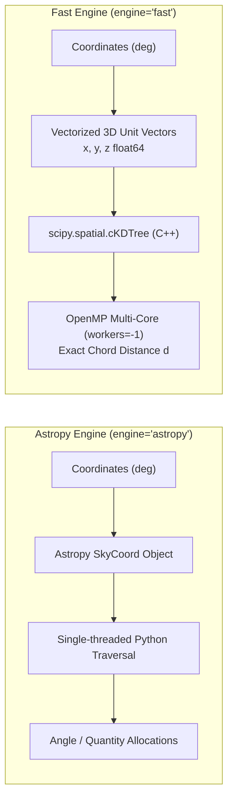
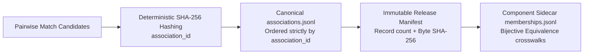

# Crossmatch Algorithms in xmatch

Algorithms and score assumptions for the matchers implemented in `xmatch`.
Literature references identify related methods or mathematical foundations;
they do not claim that every implementation is a complete reproduction.
In particular, `auf` and `macauff` are lightweight empirical heuristics.

---

## Algorithm Inventory & Capabilities

| Algorithm | Matcher Flag | Required Inputs | Scoring Metric | Literature Reference |
|---|---|---|---|---|
| **Simple Positional** | `matcher="sky"` | RA, Dec | Great-circle separation | Górski et al. (2005) |
| **Sigma-Adaptive** | `matcher="skyerr"` | RA, Dec, Errors ($\sigma_{\text{pos}}$) | Normalised separation $\frac{\text{sep}}{\sigma_1 + \sigma_2}$ | Lindegren et al. (2018) |
| **Sky Ellipse / Mahalanobis** | `matcher="skyellipse"` | RA, Dec, 2D Covariances | Mahalanobis distance $d^2$ | Pineau et al. (2017) |
| **Likelihood Ratio** | `matcher="lr"` | RA, Dec, positional errors, magnitude | Likelihood-ratio ranking and model-derived reliability | Sutherland & Saunders (1992) |
| **Random Forest** | `matcher="ml"` | RA, Dec, Photometry/Colors | Pseudo-label classifier score $[0, 1]$ | Bai et al. (2019) |
| **XGBoost / LightGBM** | `matcher="xgb"` | RA, Dec, Photometry/Colors | Gradient boosted score $[0, 1]$ | Chen & Guestrin (2016) |
| **AUF-inspired score** | `matcher="auf"` | RA, Dec | Candidate-separation/background heuristic score | Related: Wilson & Naylor (2017); not a full reproduction |
| **Flux-augmented AUF heuristic** | `matcher="macauff"` | RA, Dec, optional multi-band magnitudes | Positional heuristic with approximate flux likelihood ratios | Related: macauff; not a full reproduction |
| **Bayesian Pairwise** | `probabilistic=True` or `prior_columns` | RA, Dec, positional errors, optional photometry | $p_{\text{match}}$ under explicit model assumptions | Related positional model: Budavári & Szalay (2008) |
| **$N$-Way Bayesian** | `nway_match()` | RA, Dec, Errors, Priors ($N$ catalogs) | Full $N$-way joint Bayes factor | Budavári & Szalay (2008) |
| **Friends-of-Friends** | `fof_match()` | RA, Dec ($N$ catalogs) | Connected component bundle | Huchra & Geller (1982) |
| **PM Drift Prior** | `pm_prior=True` | RA, Dec, known epoch, Galactic $b$ | Assumed kinematic uncertainty inflation $\sigma_{\text{drift}}$ | Wilson (2023) |

---

## Technical Comparison: Astropy vs. SciPy cKDTree

The core spatial engine determines performance, memory efficiency, and parallelization.

### 1. Vectorized Unit-Sphere Coordinate Embedding

Rather than evaluating spherical trigonometry on individual coordinates, `engine="fast"` maps RA ($\alpha$) and Dec ($\delta$) to 3D Cartesian coordinates on the unit sphere:

$$x = \cos(\delta)\cos(\alpha), \quad y = \cos(\delta)\sin(\alpha), \quad z = \sin(\delta)$$

The 3D Euclidean chord distance $d$ between two points on the unit sphere is directly related to the great-circle angular separation $\theta$:

$$d = 2 \sin\left(\frac{\theta}{2}\right), \quad \theta = 2 \arcsin\left(\frac{d}{2}\right)$$

For small angular separations ($\theta \ll 1\text{ rad}$):
$$d \approx \theta_{\text{rad}} = \theta_{\text{arcsec}} \times \frac{\pi}{648\,000}$$

The implementation uses stable spherical-to-chord conversions to prune candidates, then reports great-circle separation. Floating-point behavior is not a promise of bit-level parity across backends.

### 2. Algorithmic and Architectural Differences

| Attribute | `astropy` Engine | `fast` Engine (`scipy.spatial.cKDTree`) |
|---|---|---|
| **Underlying Implementation** | Astropy sky-coordinate query APIs | `scipy.spatial.cKDTree` |
| **Coordinate Representation** | `astropy.coordinates.SkyCoord` | Unit-sphere Cartesian arrays |
| **Parallelism** | Depends on Astropy query and installed backend | Depends on SciPy query and selected options |
| **Memory Footprint** | Depends on input and candidate counts | Depends on input and candidate counts |
| **Multimodal Matching** | 2D Spatial coordinates only | Supports $N$-D Euclidean ranking via `extra_distance_cols` |

Timing and memory depend on hardware, catalogue density, candidate count,
matcher, and installed libraries. Use [`scripts/bench_engines.py`](../scripts/bench_engines.py)
on representative data; the script does not establish universal speedup ratios.

---

## Detailed Formulations of Implemented Algorithms

### 1. Simple Positional (`matcher="sky"`)

Evaluates the great-circle distance $\theta$ between sources. A candidate pair is admitted if:
$$\theta \le \theta_{\text{radius}}$$

For `find="best"`, the algorithm selects the nearest neighbor ($\arg\min \theta$). For `find="all"`, all candidates within the search radius are returned.

### 2. Sigma-Based Positional (`matcher="skyerr"`)

Adapts the match threshold per pair based on configured positional errors:
$$\sigma_1 = \sqrt{\sigma_{\text{ra}, 1}^2 + \sigma_{\text{dec}, 1}^2}, \quad \sigma_2 = \sqrt{\sigma_{\text{ra}, 2}^2 + \sigma_{\text{dec}, 2}^2}$$
$$\theta \le N_{\sigma} \cdot (\sigma_1 + \sigma_2)$$

All engines enforce the row-level filter per pair, and `find="best"` ranks candidates by the normalized separation:
$$\text{rank} = \frac{\theta}{\sigma_1 + \sigma_2}$$

For each catalogue, the engine combines the two axis errors as radial RMS
`hypot(sigma_ra, sigma_dec)` for the search criterion. Generic TAP schema
discovery does not invent these errors. Supply or configure meaningful
uncertainties; a catalogue-level default is an assumed input model, not a
measured per-row covariance.

### 3. Sky Ellipse / Mahalanobis (`matcher="skyellipse"`)

Models source coordinates as 2D bivariate Gaussian distributions with covariance matrices:
$$C = \begin{pmatrix} \sigma_{\alpha*}^2 & \sigma_{\alpha*} \sigma_{\delta} \rho \\ \sigma_{\alpha*} \sigma_{\delta} \rho & \sigma_{\delta}^2 \end{pmatrix}, \quad \sigma_{\alpha*} = \sigma_{\alpha}\cos(\delta)$$

The joint covariance matrix of the pair is $C_{\text{joint}} = C_1 + C_2$. The Mahalanobis distance squared $d^2$ is:
$$d^2 = \Delta \mathbf{r}^T C_{\text{joint}}^{-1} \Delta \mathbf{r}, \quad \Delta \mathbf{r} = \begin{pmatrix} (\alpha_1 - \alpha_2)\cos\left(\frac{\delta_1+\delta_2}{2}\right) \\ \delta_1 - \delta_2 \end{pmatrix}$$

A pair matches if $d^2 \le N_{\sigma}^2$. `zone` and `fast` query $k > 1$ candidates inside a conservative chord radius to guarantee finding the true minimum-$d^2$ counterpart.

### 4. Likelihood Ratio (`matcher="lr"`)

Based on Sutherland & Saunders (1992):
$$LR = \frac{q(m) \cdot f(r)}{n(m)}$$
- $f(r)$: Rayleigh radial probability density function:
  $$f(r) = \frac{r}{\sigma_{\text{pos}}^2} \exp\left(-\frac{r^2}{2\sigma_{\text{pos}}^2}\right)$$
- $q(m)$: Probability density of the true counterpart possessing magnitude $m$. Estimated by subtracting the normalized background distribution from candidate matches.
- $n(m)$: Surface density of background objects per magnitude bin.
- Counterpart reliability $R_j$:
  $$R_j = \frac{LR_j}{\sum_i LR_i + (1 - Q)}$$
  where $Q$ is the prior probability that the primary object has a detectable counterpart.

### 5. Machine Learning Classifiers (`matcher="ml"`, `matcher="xgb"`)

Classifiers trained on-the-fly using self-match nearest-neighbour pseudo-labels:
- **Engineered Features**:
  1. $\frac{\text{sep}}{\sigma_{\text{comb}}}$ (normalised separation)
  2. $\frac{|c_{1, k} - c_{2, k}|}{\sigma_{\text{col}}}$ (color differences across user-specified photometric bands)
  3. $\ln(1 + \rho_{\text{local}})$ (local source density)
- **Classifiers**:
  - `matcher="ml"`: Scikit-learn `RandomForestClassifier`.
  - `matcher="xgb"`: XGBoost $\to$ LightGBM $\to$ `GradientBoostingClassifier`.
- **Model Persistence**: Serialized via `joblib` (`--ml-model-path` / `--xgb-model-path`) for reuse without retraining.

Synthetic far-pair negatives use a local fixed seed. These pseudo-label-trained
scores are not calibrated posterior probabilities. Saved files contain the
classifier, not a fitted feature scaler; colour scales are recomputed for each
query, so reuse across different candidate populations does not guarantee
consistent feature scaling. Keep feature column order and units compatible.

### 6. AUF-inspired empirical scores (`matcher="auf"`, `matcher="macauff"`)

These flags implement lightweight heuristics inspired by AUF/macauff, not the
full published methods. `auf` builds a log-spaced histogram of the observed
candidate separations, subtracts the expected annular background count
(estimated from the right-catalogue footprint), and scores pairs from the
remaining positive histogram against the estimated background density. If no
positive residual remains, it falls back to nearest-neighbour ranking. Results
depend on the candidate set and footprint estimate, so `auf_prob` is not a
calibrated counterpart probability.

`macauff` multiplies the positional heuristic's odds by approximate
per-magnitude-column likelihood ratios. Its match model is Gaussian in the
magnitude difference; its no-match model is estimated from up to 5,000 random
cross-catalogue pairs per column. When magnitude errors are absent, it assumes
0.1 mag scatter. This is a heuristic, not a full macauff implementation or a
calibrated joint positional/flux likelihood.

### 7. PM Drift Prior (`pm_prior=True`, Wilson 2023-inspired)

Compensates for unknown stellar proper motions when crossmatching across long epoch baselines:
$$\sigma_\mu(b) = 3 + 7 \exp\left(-\frac{|b|}{20^\circ}\right) \quad [\text{mas/yr}]$$
$$\sigma_{\text{drift}} = \sigma_\mu(b) \cdot \frac{|\Delta t|}{1000} \cdot S(m) \quad [\text{arcsec}]$$
where $S(m) = \text{clip}(10^{-0.2(m - 15)}, 0.3, 3.0)$ is an optional magnitude distance-proxy scaling.

Added in quadrature to per-axis uncertainties:
$$\sigma_{\text{total}}^2 = \sigma_{\text{astrometric}}^2 + \sigma_{\text{drift}}^2$$

### 8. Bayesian pairwise qualification and N-way scores

Pairwise `probabilistic=True` computes positional-only `p_match`; a nonempty
`MatchSpec.prior_columns` also enables the score and adds photometric terms.
It compares an isotropic
two-dimensional Gaussian positional likelihood against a uniform-background
likelihood inside the search disc. Both catalogues must have declared positional
errors or an explicit `default_pos_error_arcsec`; the scorer does not invent an
uncertainty floor. Row errors are combined into radial RMS values and converted
to an effective isotropic per-axis sigma by dividing by $\sqrt{2}$; the pair variance is
the sum of the two per-axis variances. Ellipse orientation is not retained by this
score. Use `skyellipse` for covariance-aware candidate selection, while
recognizing that this Bayesian qualifier remains isotropic.

When `MatchSpec.prior_columns` are supplied, photometric KDE terms are added.
Each KDE is fitted to an
unconditional sample from the union of the two input catalogues (at most 50,000
values per column, chosen with a fixed seed), not only matched pairs. The match
hypothesis evaluates the KDE at the pair midpoint; the background hypothesis
evaluates the two sources independently. Degenerate KDE inputs fall back to a
uniform photometric prior.

The resulting `p_match` uses equal prior odds and a uniform background inside
the search disc. It is conditional on those assumptions; it does not include
empirical local source density or population prevalence and is not a calibrated
probability that two records identify the same physical object.

For N-way tuples, the spatial Bayes factor uses the small-angle, high-precision
approximation in Budavári & Szalay (2008), equation 18. Its Gaussian uncertainty
model is intended for small astrometric errors, not broad angular distributions:
$$B = \frac{p(\mathbf{x}_1, \dots, \mathbf{x}_N \mid H_{\text{match}})}{p(\mathbf{x}_1, \dots, \mathbf{x}_N \mid H_{\text{bg}})} = 2^{N-1} \frac{\prod_{i=1}^N w_i}{W} \exp\left(-\frac{1}{2} \sum_{i<j} \frac{w_i w_j}{W} \psi_{ij}^2\right)$$
where $w_i = 1/\sigma_i^2$, $W = \sum w_i$, the $\sigma_i$ are effective isotropic per-axis uncertainties in radians, and $\psi_{ij}$ is the great-circle separation in radians. The search radius restricts candidate generation; it is not part of this Bayes factor. Optional photometric KDE terms use unconditional source samples as described above. Each requested prior column must be present in every catalogue with the same physical meaning; normalize deliberately before matching if units or definitions differ. These KDE ratios are heuristic qualifications, not calibrated population posteriors.

The N-way posterior output applies equal prior odds ($P_0 = 0.5$) through a stable logistic transform. N-way scores also require positional uncertainty metadata or explicit per-catalogue error floors:
$$p_{\text{match}} = \frac{1}{1 + \exp(-(\ln B + \ln P_0 - \ln(1 - P_0)))}$$
preventing arithmetic overflow. As in the pairwise case, this score is not a population-calibrated probability or an inference of surveyed-source identity. `max_tuples_per_source` truncates a large per-primary Cartesian product; a truncated result is not an exhaustive hypothesis list.

### 9. Friends-of-Friends Transitive Closure (`fof_match`)

Graph clustering algorithm:
1. Forms spatial edges between detections within `radius_arcsec`.
2. Computes the connected components via union-find with path compression.
3. Emits rows for components containing a source from catalogue 1, with bundle identifier `bundle_id` and membership string `_src_cats`. Secondary-only components are omitted; isolated primary rows remain. Numeric attributes are averaged and nonnumeric attributes use the first value.

### 10. Relational ID Join (`id_join=True`)

Engine-agnostic relational equi-join executed directly in Polars on source identifier columns (e.g. `objid`, `source_id`). Bypasses spatial index construction entirely; operates in streaming mode when outputs are directed to file sinks.

### 11. Graph Association & Provenance Identity (`xmatch.association.v1`)

The association algorithm solves the fundamental identity challenge in astronomical crossmatching: mutable graph components must not be conflated with permanent celestial object identifiers. (See [`docs/association-v1.md`](association-v1.md)).

1. **Content-Addressed Identity**:
   $$\text{association\_id} = \text{SHA-256}(\text{evidence\_id} \,\|\, \text{source\_id} \,\|\, \text{candidate\_id} \,\|\, t_{\text{eval}} \,\|\, \text{release\_ids} \,\|\, \text{params})$$
2. **Fail-Closed Validation**: Release directories enforce strict byte-level checksums, monotonic SHA-256 key ordering, and bounded-memory streaming iteration.
3. **Cross-Release Equivalence Crosswalks**: Tracks object splits, merges, and re-identifications across survey data releases without heuristic bare-string ID matching.

---

## 🔭 Astronomer's Precision & Error Analysis

A rigorous assessment of real-world observational systematics encountered during crossmatching:

### 1. Non-Gaussian Astrometric Error Distributions
`skyerr` applies the declared radial-RMS threshold and does not model
non-Gaussian PSF wings. Ground-based errors may have such tails, but their size
is survey- and selection-dependent. The current `auf` and `macauff` scores are
empirical heuristics rather than full non-Gaussian error models; validate them
against labelled or injected data before using them for scientific decisions.

### 2. Chromatic & Kinematic Systematics
- **Differential Chromatic Refraction (DCR)**: Atmospheric refraction shifts blue and red photons by up to 0.1″–0.3″ at high airmass, introducing wavelength-dependent positional offsets between $u$-band and $z$-band centroids.
- **Unmodeled Proper Motion**: Stellar drift across decade-long baselines produces systematic coordinate offsets that scale with Galactic latitude.
- *Astronomical Guidance*: For large epoch baselines, use measured motion and a known reference epoch where available. Enable `pm_prior=True` only when its assumed population drift model is appropriate for rows lacking measured motion; it is not a universal correction.

### 3. Ambiguity & Blending in Crowded Fields
In dense stellar environments (e.g., the Galactic bulge, Magellanic Clouds, or globular clusters), source surface density $\rho$ satisfies $\pi r^2 \rho \approx 1$.
- *Astronomical Guidance*: In crowded regimes, `find="best"` by spatial proximity alone exhibits high false-positive rates. Use `extra_distance_cols={"phot_g_mean_mag": 0.5}` or `matcher="lr"` / `matcher="xgb"` with color differences to incorporate photometry into the candidate ranking metric.

### 4. Semantic Score Calibration
Not all output scores represent true probabilities:
- `ranking_score` (`ml_score`, `xgb_score`, `lr`): Useful for ranking within a candidate list, but not calibrated probabilities.
- `assumed_prior_posterior` (`p_match`): A Bayesian posterior derived under assumed priors, not an empirical probability.
- `reliability` under Sutherland & Saunders LR: A model-derived reliability using estimated counterpart and background distributions; its calibration depends on those estimates and survey selection.
