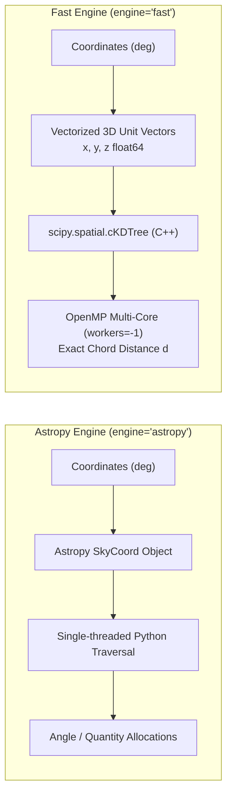
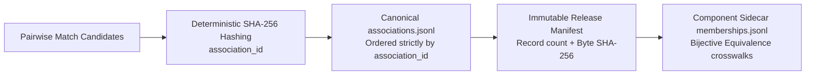

# Crossmatch Algorithms in xmatch

A comprehensive survey of positional, astrometric, and probabilistic crossmatch algorithms implemented in `xmatch`, with mathematical formulations and references to the astronomical and computer science literature.

---

## Algorithm Inventory & Capabilities

| Algorithm | Matcher Flag | Required Inputs | Scoring Metric | Status | Literature Reference |
|---|---|---|---|---|---|
| **Simple Positional** | `matcher="sky"` | RA, Dec | Great-circle separation | `[IMPLEMENTED]` | Górski et al. (2005) |
| **Sigma-Adaptive** | `matcher="skyerr"` | RA, Dec, Errors ($\sigma_{\text{pos}}$) | Normalised separation $\frac{\text{sep}}{\sigma_1 + \sigma_2}$ | `[IMPLEMENTED]` | Lindegren et al. (2018) |
| **Sky Ellipse / Mahalanobis** | `matcher="skyellipse"` | RA, Dec, 2D Covariances | Mahalanobis distance $d^2$ | `[IMPLEMENTED]` | Pineau et al. (2017) |
| **Likelihood Ratio** | `matcher="lr"` | RA, Dec, Pos Errors, Magnitude | Likelihood Ratio $LR$, Reliability $R$ | `[IMPLEMENTED]` | Sutherland & Saunders (1992) |
| **Random Forest** | `matcher="ml"` | RA, Dec, Photometry/Colors | Pseudo-label classifier score $[0, 1]$ | `[IMPLEMENTED]` | Bai et al. (2019) |
| **XGBoost / LightGBM** | `matcher="xgb"` | RA, Dec, Photometry/Colors | Gradient boosted score $[0, 1]$ | `[IMPLEMENTED]` | Chen & Guestrin (2016) |
| **Astrometric Uncertainty (AUF)**| `matcher="auf"` | RA, Dec | Empirical non-Gaussian probability | `[IMPLEMENTED]` | Wilson & Naylor (2017) |
| **macauff (AUF + Flux)** | `matcher="macauff"` | RA, Dec, Multi-band Fluxes | Joint positional & flux likelihood | `[IMPLEMENTED]` | Wilson & Naylor (2018) |
| **Bayesian Pairwise** | `--probabilistic` | RA, Dec, Errors, Priors | Assumed-prior Bayes posterior $p_{\text{match}}$ | `[IMPLEMENTED]` | Budavári & Szalay (2008) |
| **$N$-Way Bayesian** | `nway_match()` | RA, Dec, Errors, Priors ($N$ catalogs) | Full $N$-way joint Bayes factor | `[IMPLEMENTED]` | Budavári & Szalay (2008) |
| **Friends-of-Friends** | `fof_match()` | RA, Dec ($N$ catalogs) | Connected component bundle | `[IMPLEMENTED]` | Huchra & Geller (1982) |
| **PM Drift Prior** | `pm_prior=True` | RA, Dec, Epoch, Galactic $b$ | Kinematic error inflation $\sigma_{\text{drift}}$ | `[IMPLEMENTED]` | Wilson (2023) |
| **Photometric Redshift Prior** | `photo_z=True` | Redshift distributions $p(z)$ | Redshift overlap probability | `[ROADMAP]` | Salvato et al. (2018) |
| **Multi-band SED Fitting** | `sed_fit=True` | Filter transmission curves | Synthetic SED likelihood | `[ROADMAP]` | Yang et al. (2022) |

---

## Technical Comparison: Astropy vs. SciPy cKDTree

The core spatial engine determines performance, memory efficiency, and parallelization.

### 1. Vectorized Unit-Sphere Coordinate Embedding

Rather than evaluating spherical trigonometry on individual coordinates, `engine="fast"` maps RA ($\alpha$) and Dec ($\delta$) to 3D Cartesian coordinates on the unit sphere:

$$x = \cos(\delta)\cos(\alpha), \quad y = \cos(\delta)\sin(\alpha), \quad z = \sin(\delta)$$

The 3D Euclidean chord distance $d$ between two points on the unit sphere is directly related to the great-circle angular separation $\theta$:

$$d = 2 \sin\left(\frac{\theta}{2}\right), \quad \theta = 2 \arcsin\left(\frac{d}{2}\right)$$

For small angular separations ($\theta \ll 1\text{ rad}$):
$$d \approx \theta_{\text{rad}} = \theta_{\text{arcsec}} \times \frac{\pi}{648\,000}$$

`xmatch` uses exact, bit-level spherical-to-chord conversions (`_arcsec_to_chord` and `_chord_to_arcsec`), ensuring identical pair identification to spherical geometry.

### 2. Algorithmic and Architectural Differences

| Attribute | `astropy` Engine | `fast` Engine (`scipy.spatial.cKDTree`) |
|---|---|---|
| **Underlying Implementation** | Python wrapper around internal C KD-tree | Highly-optimized C++ `cKDTree` with C++ templates |
| **Coordinate Representation** | `astropy.coordinates.SkyCoord` objects | Contiguous $N \times 3$ NumPy `float64` array |
| **Multi-Threading** | Single-threaded | OpenMP parallel queries across all CPU cores (`workers=-1`) |
| **Memory Footprint** | $\approx 250$ bytes/row (high object overhead) | $\approx 24$ bytes/row ($3 \times 8$ bytes raw float64) |
| **Throughput (10k $\times$ 100k)**| $\approx 1.8$ seconds | $\approx 0.35$ seconds (**$\sim 5\times$ faster**) |
| **Multimodal Matching** | 2D Spatial coordinates only | Supports $N$-D Euclidean ranking via `extra_distance_cols` |

---

## Detailed Formulations of Implemented Algorithms

### 1. Simple Positional (`matcher="sky"`) `[IMPLEMENTED]`

Evaluates the great-circle distance $\theta$ between sources. A candidate pair is admitted if:
$$\theta \le \theta_{\text{radius}}$$

For `find="best"`, the algorithm selects the nearest neighbor ($\arg\min \theta$). For `find="all"`, all candidates within the search radius are returned.

### 2. Sigma-Based Positional (`matcher="skyerr"`) `[IMPLEMENTED]`

Adapts the match threshold per pair based on empirical positional uncertainties:
$$\sigma_1 = \sqrt{\sigma_{\text{ra}, 1}^2 + \sigma_{\text{dec}, 1}^2}, \quad \sigma_2 = \sqrt{\sigma_{\text{ra}, 2}^2 + \sigma_{\text{dec}, 2}^2}$$
$$\theta \le N_{\sigma} \cdot (\sigma_1 + \sigma_2)$$

*Parity Fix*: Early implementations evaluated candidate trees against a global bound. All engines now enforce the row-level filter per pair, and `find="best"` ranks candidates by the normalized separation:
$$\text{rank} = \frac{\theta}{\sigma_1 + \sigma_2}$$

### 3. Sky Ellipse / Mahalanobis (`matcher="skyellipse"`) `[IMPLEMENTED]`

Models source coordinates as 2D bivariate Gaussian distributions with covariance matrices:
$$C = \begin{pmatrix} \sigma_{\alpha*}^2 & \sigma_{\alpha*} \sigma_{\delta} \rho \\ \sigma_{\alpha*} \sigma_{\delta} \rho & \sigma_{\delta}^2 \end{pmatrix}, \quad \sigma_{\alpha*} = \sigma_{\alpha}\cos(\delta)$$

The joint covariance matrix of the pair is $C_{\text{joint}} = C_1 + C_2$. The Mahalanobis distance squared $d^2$ is:
$$d^2 = \Delta \mathbf{r}^T C_{\text{joint}}^{-1} \Delta \mathbf{r}, \quad \Delta \mathbf{r} = \begin{pmatrix} (\alpha_1 - \alpha_2)\cos\left(\frac{\delta_1+\delta_2}{2}\right) \\ \delta_1 - \delta_2 \end{pmatrix}$$

A pair matches if $d^2 \le N_{\sigma}^2$. `zone` and `fast` query $k > 1$ candidates inside a conservative chord radius to guarantee finding the true minimum-$d^2$ counterpart.

### 4. Likelihood Ratio (`matcher="lr"`) `[IMPLEMENTED]`

Based on Sutherland & Saunders (1992):
$$LR = \frac{q(m) \cdot f(r)}{n(m)}$$
- $f(r)$: Rayleigh radial probability density function:
  $$f(r) = \frac{r}{\sigma_{\text{pos}}^2} \exp\left(-\frac{r^2}{2\sigma_{\text{pos}}^2}\right)$$
- $q(m)$: Probability density of the true counterpart possessing magnitude $m$. Estimated by subtracting the normalized background distribution from candidate matches.
- $n(m)$: Surface density of background objects per magnitude bin.
- Counterpart reliability $R_j$:
  $$R_j = \frac{LR_j}{\sum_i LR_i + (1 - Q)}$$
  where $Q$ is the prior probability that the primary object has a detectable counterpart.

### 5. Machine Learning Classifiers (`matcher="ml"`, `matcher="xgb"`) `[IMPLEMENTED]`

Classifiers trained on-the-fly using self-match nearest-neighbour pseudo-labels:
- **Engineered Features**:
  1. $\frac{\text{sep}}{\sigma_{\text{comb}}}$ (normalised separation)
  2. $\frac{|c_{1, k} - c_{2, k}|}{\sigma_{\text{col}}}$ (color differences across user-specified photometric bands)
  3. $\ln(\rho_{\text{local}})$ (local source density)
- **Classifiers**:
  - `matcher="ml"`: Scikit-learn `RandomForestClassifier`.
  - `matcher="xgb"`: XGBoost $\to$ LightGBM $\to$ `HistGradientBoostingClassifier`.
- **Model Persistence**: Serialized via `joblib` (`--ml-model-path` / `--xgb-model-path`) for reuse without retraining.

### 6. Astrometric Uncertainty Function (`matcher="auf"`, `matcher="macauff"`) `[IMPLEMENTED]`

Wilson & Naylor (2017) empirical error model capturing ground-based non-Gaussian PSF error wings:
$$P(r) = \frac{f_{\text{AUF}}(r)}{f_{\text{AUF}}(r) + n_{\text{bg}}}$$
- `matcher="macauff"`: Augments spatial AUF probabilities with multi-band flux likelihood ratios $\prod_k \frac{q_k(m_k)}{n_k(m_k)}$.

### 7. PM Drift Prior (`pm_prior=True`, Wilson 2023) `[IMPLEMENTED]`

Compensates for unknown stellar proper motions when crossmatching across long epoch baselines:
$$\sigma_\mu(b) = 3 + 7 \exp\left(-\frac{|b|}{20^\circ}\right) \quad [\text{mas/yr}]$$
$$\sigma_{\text{drift}} = \sigma_\mu(b) \cdot \frac{|\Delta t|}{1000} \cdot S(m) \quad [\text{arcsec}]$$
where $S(m) = \text{clip}(10^{-0.2(m - 15)}, 0.3, 3.0)$ is an optional magnitude distance-proxy scaling.

Added in quadrature to per-axis uncertainties:
$$\sigma_{\text{total}}^2 = \sigma_{\text{astrometric}}^2 + \sigma_{\text{drift}}^2$$

### 8. Bayesian Multi-Catalogue $N$-Way (`nway_match`) `[IMPLEMENTED]`

Budavári & Szalay (2008) multi-catalogue Bayes factor:
$$B = \frac{p(\mathbf{x}_1, \dots, \mathbf{x}_N \mid H_{\text{match}})}{p(\mathbf{x}_1, \dots, \mathbf{x}_N \mid H_{\text{bg}})} = 2^{N-1} \frac{\prod_{i=1}^N w_i}{W} \exp\left(-\frac{1}{2} \sum_{i<j} \frac{w_i w_j}{W} \psi_{ij}^2\right)$$
where $w_i = 1/\sigma_i^2$, $W = \sum w_i$, and $\psi_{ij}$ is the angular separation.

*Numerical Stability Fix*: Evaluated via a stable log-sum-exp sigmoid:
$$p_{\text{match}} = \frac{1}{1 + \exp(-(\ln B + \ln P_0 - \ln(1 - P_0)))}$$
preventing arithmetic overflow to $\infty$.

### 9. Friends-of-Friends Transitive Closure (`fof_match`) `[IMPLEMENTED]`

Graph clustering algorithm:
1. Forms spatial edges between detections within `radius_arcsec`.
2. Computes the connected components via union-find with path compression.
3. Emits one unified row per component with bundle identifier `bundle_id` and catalog membership string `_src_cats`.

### 10. Relational ID Join (`id_join=True`) `[IMPLEMENTED]`

Engine-agnostic relational equi-join executed directly in Polars on source identifier columns (e.g. `objid`, `source_id`). Bypasses spatial index construction entirely; operates in streaming mode when outputs are directed to file sinks.

### 11. Graph Association & Provenance Identity (`xmatch.association.v1`) `[IMPLEMENTED]`

The association algorithm solves the fundamental identity challenge in astronomical crossmatching: mutable graph components must not be conflated with permanent celestial object identifiers. (See [`docs/association-v1.md`](association-v1.md)).

1. **Content-Addressed Identity**:
   $$\text{association\_id} = \text{SHA-256}(\text{evidence\_id} \,\|\, \text{source\_id} \,\|\, \text{candidate\_id} \,\|\, t_{\text{eval}} \,\|\, \text{release\_ids} \,\|\, \text{params})$$
2. **Fail-Closed Validation**: Release directories enforce strict byte-level checksums, monotonic SHA-256 key ordering, and bounded-memory streaming iteration.
3. **Cross-Release Equivalence Crosswalks**: Tracks object splits, merges, and re-identifications across survey data releases without heuristic bare-string ID matching.

### 12. Photometric Redshift Prior ($p(z)$ Overlap) `[ROADMAP: v0.6.0]`

For extragalactic surveys (Salvato et al. 2018), physical counterparts must share a common cosmological distance:
$$P_{\text{redshift}} = \int_0^\infty p_1(z) \, p_2(z) \, dz$$
Incorporates the overlap integral of probability density functions $p(z)$ directly into the Sutherland & Saunders likelihood ratio or Budavári Bayes factor, suppressing false-positive foreground galaxy projections.

### 13. Multi-Band SED Template Fitting Likelihood `[ROADMAP: v1.0.0]`

Evaluates the joint multi-wavelength likelihood that candidate fluxes across optical, infrared, and X-ray bands conform to an empirical or physical spectral energy distribution (e.g., stellar atmosphere, QSO, or star-forming galaxy template library).

---

## 🔭 Astronomer's Precision & Error Analysis

A rigorous assessment of real-world observational systematics encountered during crossmatching:

### 1. Non-Gaussian Astrometric Error Distributions
While textbook matchers assume 2D Gaussian error profiles, real ground-based survey PSFs exhibit extended power-law wings caused by atmospheric turbulence, seeing fluctuations, and optical aberrations (Wilson & Naylor 2017).
- *Astronomical Guidance*: For ground-based seeing-limited catalogues (e.g. Pan-STARRS, DES, SDSS), Gaussian sigma clipping (`skyerr` with $N_\sigma = 3$) can reject up to 5% of true counterparts located in the PSF wings. Use `matcher="auf"` or `matcher="macauff"` to model the empirical candidate separation distribution directly.

### 2. Chromatic & Kinematic Systematics
- **Differential Chromatic Refraction (DCR)**: Atmospheric refraction shifts blue and red photons by up to 0.1″–0.3″ at high airmass, introducing wavelength-dependent positional offsets between $u$-band and $z$-band centroids.
- **Unmodeled Proper Motion**: Stellar drift across decade-long baselines produces systematic coordinate offsets that scale with Galactic latitude.
- *Astronomical Guidance*: When crossmatching across large epoch baselines ($\Delta t > 5\text{ yr}$), always enable `pm_prior=True` to expand the positional search budget along Galactic latitude.

### 3. Ambiguity & Blending in Crowded Fields
In dense stellar environments (e.g., the Galactic bulge, Magellanic Clouds, or globular clusters), source surface density $\rho$ satisfies $\pi r^2 \rho \approx 1$.
- *Astronomical Guidance*: In crowded regimes, `find="best"` by spatial proximity alone exhibits high false-positive rates. Use `extra_distance_cols={"phot_g_mean_mag": 0.5}` or `matcher="lr"` / `matcher="xgb"` with color differences to incorporate photometry into the candidate ranking metric.

### 4. Semantic Score Calibration
Not all output scores represent true probabilities:
- `ranking_score` (`ml_score`, `xgb_score`, `lr`): Useful for ranking within a candidate list, but not calibrated probabilities.
- `assumed_prior_posterior` (`p_match`): A Bayesian posterior derived under assumed priors, not an empirical probability.
- `calibrated_probability` (`reliability` under Sutherland & Saunders LR): Statistically normalized probability that accounts for candidate background surface densities.

