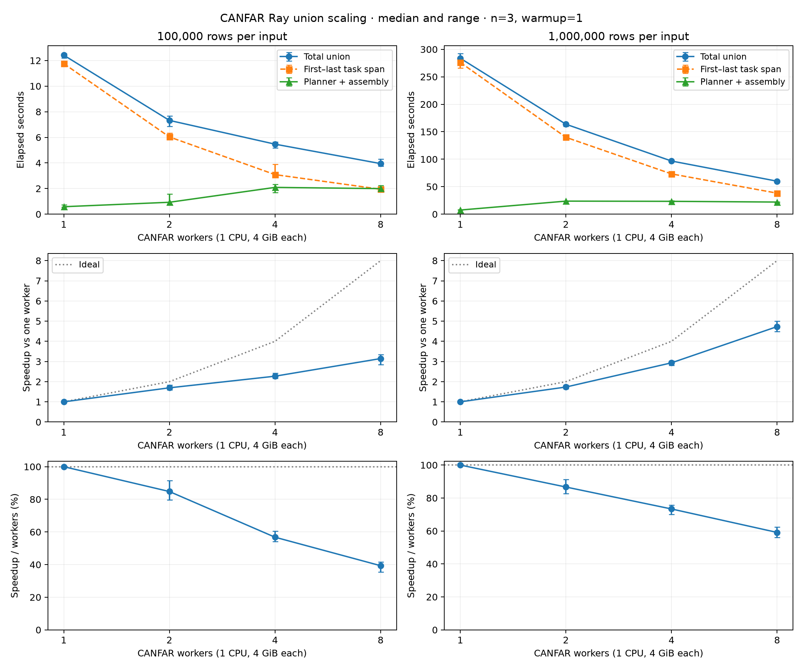

# CANFAR Ray union scaling — 2026-10-07

The frozen release-candidate `xmatch` wheel was measured on CANFAR with 1, 2, 4, and 8 Ray workers for two input sizes: 100,000 and 1,000,000 rows per input catalogue. The manager head had a fixed allocation of 2 CPUs and 8 GiB but advertised zero Ray CPUs; each worker had one CPU and 4 GiB. Aggregate cluster memory, including the head, was 12, 16, 24, and 40 GiB for 1, 2, 4, and 8 workers, respectively. Worker probes confirmed matching package-file hashes and dependency versions. The wheel SHA-256 was `5d7f6054d7de5d9208837d17ca6bf264f5b0848a213fbb6d1cce4c27f75fd871`. The same input files were used at each worker count for a given input size.

Each configuration had one warmup run (iteration 0), followed by three measured runs (iterations 1–3). The table reports the median measured union wall time, the observed minimum–maximum range, and speedup relative to the one-worker median at the same input size. Efficiency is speedup divided by the worker count. The ranges describe these three repetitions; they are not confidence intervals.

| Rows per input | Workers | Union median [range] (s) | Speedup | Efficiency | Planner + assembly median (s) |
| ---: | ---: | ---: | ---: | ---: | ---: |
| 100,000 | 1 | 12.416 [12.209–12.555] | 1.00× | 100.0% | 0.581 |
| 100,000 | 2 | 7.323 [6.858–7.666] | 1.70× | 84.8% | 0.929 |
| 100,000 | 4 | 5.467 [5.179–5.639] | 2.27× | 56.8% | 2.091 |
| 100,000 | 8 | 3.947 [3.764–4.299] | 3.15× | 39.3% | 1.995 |
| 1,000,000 | 1 | 283.778 [273.146–292.303] | 1.00× | 100.0% | 7.493 |
| 1,000,000 | 2 | 163.707 [160.016–165.343] | 1.73× | 86.7% | 23.723 |
| 1,000,000 | 4 | 96.716 [96.652–97.386] | 2.93× | 73.4% | 23.347 |
| 1,000,000 | 8 | 60.004 [58.504–60.954] | 4.73× | 59.1% | 22.028 |

At 1,000,000 rows per input, the observed median fell from 283.778 seconds on one worker to 60.004 seconds on eight workers, a 4.73× speedup and 59.1% efficiency. At 100,000 rows per input, the corresponding medians were 12.416 and 3.947 seconds, a 3.15× speedup and 39.3% efficiency. These are measurements of this workload and run; they do not identify a performance cause.

The in-run checks covered exact IDs, pair and singleton membership, non-null routing, and zero-separation behavior. Each point produced the expected row count: 150,000 rows for 100,000 rows per input and 1,500,000 for 1,000,000 rows per input. The runs planned 39 tasks per iteration at the smaller size and 374 at the larger size; all planned tasks finished, with no failed attempts and no head-node tasks. Outputs contained 29 and 286 partitions, respectively. A separate all-coordinate and HEALPix-pixel post-validation pass was not run.

The CSV contains all 32 iteration-level observations, including the warmups and task timing summaries. `union_seconds` is the end-to-end wall time for the union call, including planning, task execution, and assembly. Input tiling before the repeated calls and oracle validation after each call are excluded. `task_span_seconds` is the elapsed span from the first task start to the last task end; `task_occupied_seconds` sums task durations and can exceed wall time because tasks overlap. `planner_seconds` and `assembly_seconds` are measured stages; the table's planner-plus-assembly column is the median of their per-iteration sums.

Memory fields are diagnostic samples, not workload limits. `sampled_union_container_peak_gib` is the largest periodic sum of cgroup-charged memory across the driver and workers during an iteration; cgroup charging includes cache and is not RSS. `driver_peak_rss_mib` is driver RSS and excludes worker processes; it includes validation performed by the driver. `memory_snapshot_count` shows how many periodic samples contributed to each iteration, and some short runs had no sample.

The 16-worker point is absent: the worker-launch request returned HTTP 400 with an underlying CANFAR platform HTTP 500, so no 16-worker benchmark ran. The chart's error bars show observed min–max ranges; the speedup and efficiency ranges are envelopes formed from the baseline and treatment ranges, not confidence intervals.

Repeat-level values are in [`canfar-scaling-2026-10-07.csv`](canfar-scaling-2026-10-07.csv).
