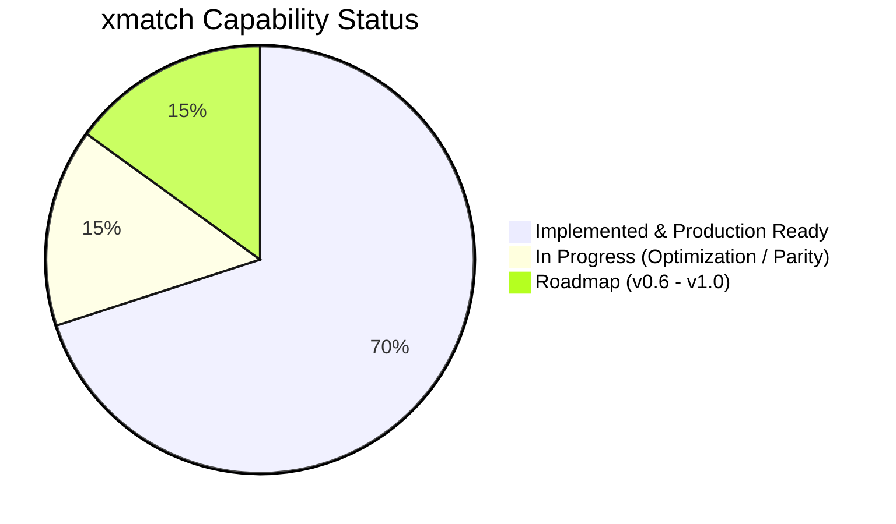
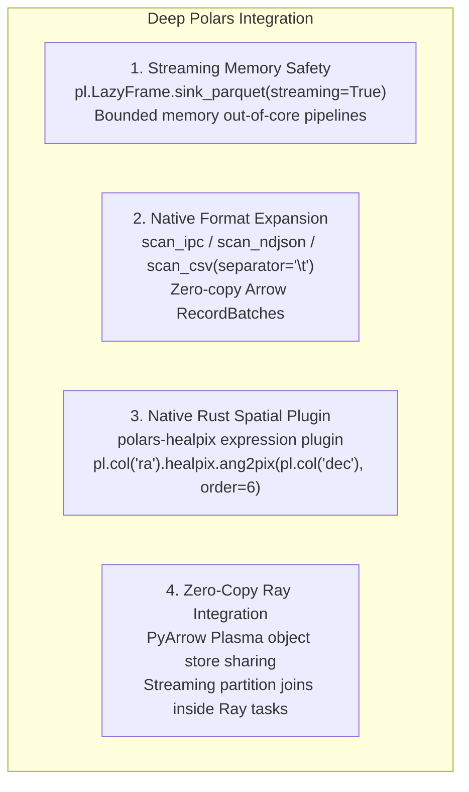
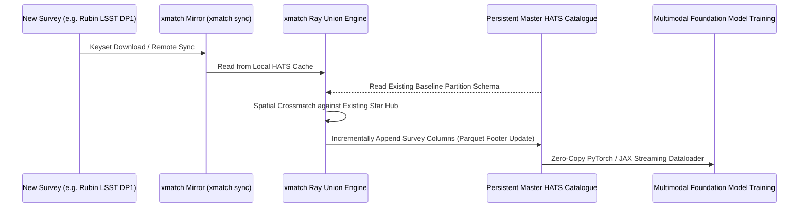
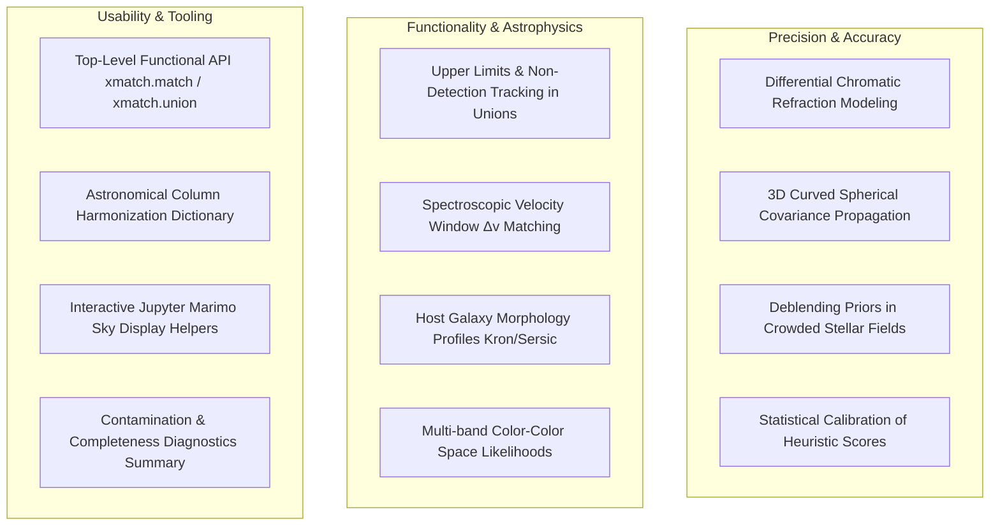

# xmatch Strategic Roadmap & Release Milestones

This document outlines the strategic vision, architectural roadmap, and prioritized milestones toward the **v1.0 release** of `xmatch`.

---

## 1. Vision Statement

To provide the astronomical community with the **definitive, high-performance, format-agnostic Swiss-Army-knife for crossmatching**:
1. **Universal I/O**: Ingest and export any astronomical format (Parquet, FITS, CSV, TSV, HATS) and query remote TAP/ADQL archives.
2. **Infinite Scale**: Scale seamlessly from interactive laptop exploration to multi-billion-row full-sky surveys across multi-node clusters.
3. **Rigorous SOTA Science**: Provide the full spectrum of positional, astrometric, and probabilistic matchers with full error covariance and kinematic modeling.
4. **Persistent Master Unions**: Enable the continuous, incremental assembly of multi-wavelength full-sky photometry into versioned HATS catalogues to train astronomical foundation models.

---

## 2. Current Status & Gap Analysis



### Gap Analysis Matrix

| Domain | Implemented Today | Remaining Gap / Need | Target Milestone |
|---|---|---|---|
| **I/O Formats** | Parquet, CSV, TSV, FITS (Torchfits/Astropy), HATS | Native Arrow IPC (`.feather`, `.arrow`), NDJSON streaming, streaming FITS chunker | v0.6.0 |
| **Data Engines** | SciPy `cKDTree` (`fast`), `zone` (cdshealpix), `ray`, `astropy`, `stilts`, `torchsky` | Native Rust Polars HEALPix spatial plugin, GPU Mahalanobis distance kernels | v0.6.0 / v1.0.0 |
| **Algorithms** | `sky`, `skyerr`, `skyellipse`, `target_epoch`, `pm_prior`, `lr`, `ml`, `xgb`, `auf`, `macauff`, `p_match`, `nway_match`, `fof_match` | Full NWAY multi-band SED template fitting, photometric redshift priors $p(z)$ | v0.6.0 |
| **Joins** | Inner, Left, Right, Full Outer, Anti, Relational ID joins, Sequential chains | Streaming Polars hash-join on spatial pixel partitions, outer-join memory optimization | v0.6.0 |
| **Mirroring & Cache** | `xmatch sync`: Keyset TAP paging, remote HATS replication, token bucket rate limiter | Remote archive checksum verification, automatic data release invalidation | v0.6.0 |
| **Master Union** | `engine="ray-union"`: Full-sky star-shaped join producing HATS partition trees | Incremental HATS mutation (append new survey columns without full re-matching) | v1.0.0 |
| **Foundation Datasets**| Versioned Association contract (`xmatch.association.v1`), component sidecars | High-throughput PyTorch / JAX spatial dataloaders for multi-band foundation models | v1.0.0 |
| **Verification & CI** | Fast preflight (`ruff`), 6 smoke guards in `test_ci_smoke.py`, ~160 unit tests | Test suite parallelization (`pytest-xdist`), sub-10s smoke suite, CANFAR NFS isolation | v0.5.0 / v0.6.0 |

---

## 3. Deep Polars Integration Strategy

Polars is the foundational execution engine of `xmatch`. As the Polars ecosystem matures, `xmatch` will deepen this integration across four core areas:



### A. Polars Rust Spatial Plugin (`polars-healpix`) `[ROADMAP]`
- **Concept**: Implement a custom Polars plugin in Rust using `polars-plugin` and `healpix` / `cdshealpix`.
- **Impact**: Computes HEALPix nested pixels directly within the Polars query optimizer without crossing into Python or allocating NumPy arrays:
  ```python
  # Target Polars expression API
  df.lazy().with_columns(
      pix=pl.col("ra").astro.healpix_ang2pix(pl.col("dec"), nside=32)
  ).group_by("pix")
  ```

### B. Streaming Out-of-Core Crossmatching `[ROADMAP]`
- **Concept**: Instead of materializing coordinate arrays into NumPy for spatial trees, stream coordinate chunks directly from Polars streaming engine partitions, match them against localized KD-tree zones, and stream results directly into `sink_parquet`.
- **Impact**: Enables 1-billion-row pairwise crossmatching on machines with as little as 16 GB RAM.

### C. Zero-Copy Ray Distributed Cluster Execution `[ROADMAP]`
- **Concept**: Exchange Polars DataFrames between Ray tasks using PyArrow RecordBatches via Ray's Plasma object store.
- **Impact**: Eliminates serialization and deserialization overhead across cluster nodes during distributed joins.

---

## 4. Persistent Incremental Master Unions for Sky Foundation Models

The ultimate scientific output of `xmatch` is serving as the generation pipeline for **multimodal astronomical foundation models**.



### Architecture for Incremental Catalogue Accumulation:
1. **Immutable Star Hubs**: Catalogue 1 (typically Gaia DR3) acts as the astrometric spine.
2. **Schema Evolution without Re-Run**: When Survey $k$ (e.g. Rubin LSST) is ingested, `xmatch` matches it against the spatial hub and appends columns to existing HATS partitions without re-matching surveys 2 through $k-1$.
3. **Continuous Photometric Enrichment**: Optical, UV, near-IR, mid-IR, and radio flux columns accumulate within a single, spatially-indexed HATS directory.
4. **Direct Dataloader Integration**: Provide PyTorch `IterableDataset` implementations that stream aligned spectral energy distributions (SEDs) directly from HATS parquet blocks for large-scale pre-training.

---

## 5. Astronomer-Driven Modernization: Precision, Accuracy, Functionality & Usability

Based on practicing astronomer workflows across observational facilities, the following upgrades are prioritized to enhance scientific fidelity:



### A. Precision & Astrometric Accuracy
1. **Differential Chromatic Refraction (DCR)**: High-airmass ground-based centroids shift as a function of stellar color ($g - i$). Support color-dependent centroid corrections during crossmatching.
2. **Curved Spherical Covariances**: For wide uncertainty ellipses ($\sigma > 10''$, typical for low-frequency radio beams), flat-sky tangent plane projections introduce tangential distortion. Support 3D rotational covariance tensors.
3. **Crowded Field Deblending**: Integrate local source confusion limits so that probability calculations account for unresolved blended flux.
4. **Empirical Calibration Framework**: Tools to calibrate raw `ml_score` and `lr` into verified empirical probabilities $P(\text{true})$ via mock source injection.

### B. Astronomical Functionality
1. **Upper Limits & Non-Detections in Unions**: When building master unions, sources undetected in band $X$ should not merely be `null`; they should record the survey detection limit (e.g. $m > 24.5$) to enable censored data analysis in downstream models.
2. **Spectroscopic Redshift & Velocity Matching**: Support joint spatial cone + radial velocity difference criteria ($|\Delta v| \le c \frac{|\Delta z|}{1+z} \le 500\,\text{km/s}$) for cluster galaxy kinematics.
3. **Host Galaxy Extended Light Profiles**: Match transients against galaxy profiles (effective radius $r_e$, axis ratio $b/a$, position angle $\theta$) rather than point-like centroids.

### C. Usability & Workflow Acceleration
1. **Top-Level Functional API**: Direct `xmatch.match(cat1, cat2, radius_arcsec=1.0)` and `xmatch.union(cats)` without boilerplate class instantiation.
2. **Survey Column Harmonizer**: Pre-built dictionary mapping common survey headers (`RAJ2000`, `DEJ2000`, `ra_icrs`, `e_ra`, `pmRA`, `phot_g_mean_mag`) to canonical internal representations.
3. **Interactive Notebook Visualizations**: Diagnostic plots (`xmatch.plot_spatial`, `xmatch.plot_reliability_histogram`) compatible with Matplotlib, Plotly, and Bokeh.

---

## 6. Release Milestones & Actionable TODOs

### Milestone v0.5.0: Parity, Performance & Docs Overhaul *(Current)*
- [x] **Audit Engine Parity**: Unify `skyerr` per-row criteria and `skyellipse` Mahalanobis search bounds across `fast`, `zone`, and `astropy`.
- [x] **Ray Union Directory Fix**: Enforce HATS `Dir=(pix // 10000) * 10000` directory naming.
- [x] **Finite Coordinate Validation**: Prevent `cdshealpix` Rust panics on non-finite coordinates with actionable exceptions.
- [x] **Numerical Stability**: Replace arithmetic overflow in `bayes.py` with stable log-sum-exp sigmoid.
- [x] **Repository Cleanup**: Delete obsolete audit logs (`AUDIT.md`, `ci_log_xmatch.txt`, `docs/audits/`).
- [x] **Consolidated Documentation**: Author `docs/api.md`, `docs/usage.md`, `docs/algorithms.md`, and `docs/roadmap.md`.
- [x] **Native TSV Support**: Implement `.tsv` and `.tab` scanning and sinks in `src/xmatch/io_utils.py`.
- [ ] **Release Tag v0.5.0**: Push green commit to `origin/main` and open PR to `upstream/main`.

### Milestone v0.6.0: Native Streaming & Deep Polars Integration
- [ ] **Native Arrow IPC Streaming**: Add `pl.scan_ipc` and `sink_ipc` support in `io_utils.py`.
- [ ] **Torchsky Engine Promotion**: Complete promotion benchmark campaign for automatic selection of `torchsky` under `engine="auto"`.
- [ ] **Polars Custom Spatial Plugin**: Prototype `polars-healpix` Rust extension for zero-GIL spatial grouping.
- [ ] **Test Suite Optimization**:
  - Set `export PYTHONNOUSERSITE=1` across all Pixi task definitions.
  - Optimize `test_ci_smoke.py` collection speed by caching `--collect-only` invocations.
  - Implement parallel test execution via `pytest-xdist` (`pixi run test -n auto`).
- [ ] **Pre-Computed Archive Expansion**: Add aliases for newly published Data Lab and VizieR crossmatch tables.

### Milestone v1.0.0: Production Master Union & Foundation Model Datasets
- [ ] **Incremental HATS Mutation**: Support appending new survey columns to existing master HATS directories without full recalculation.
- [ ] **Automated CANFAR SLURM & Kubernetes Deployments**: Standalone scripts to launch Ray union jobs across thousands of CANFAR cores.
- [ ] **Foundation Model Dataloader Package**: Export `xmatch.ml.HatsDataset` for streaming multi-band training batches directly to PyTorch and JAX.
- [ ] **Full Type Coverage**: Stricter MyPy enforcement across all public modules.
- [ ] **Automated Documentation Site**: Set up MkDocs / Sphinx documentation publishing with interactive tutorials.
