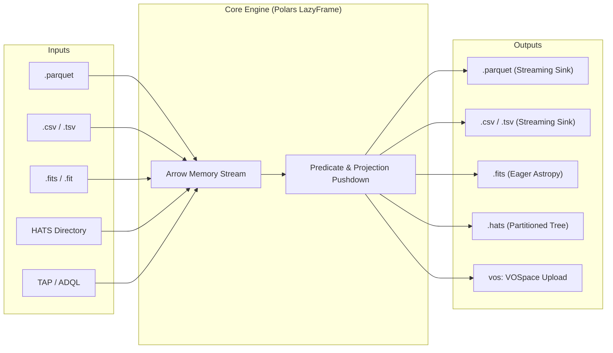
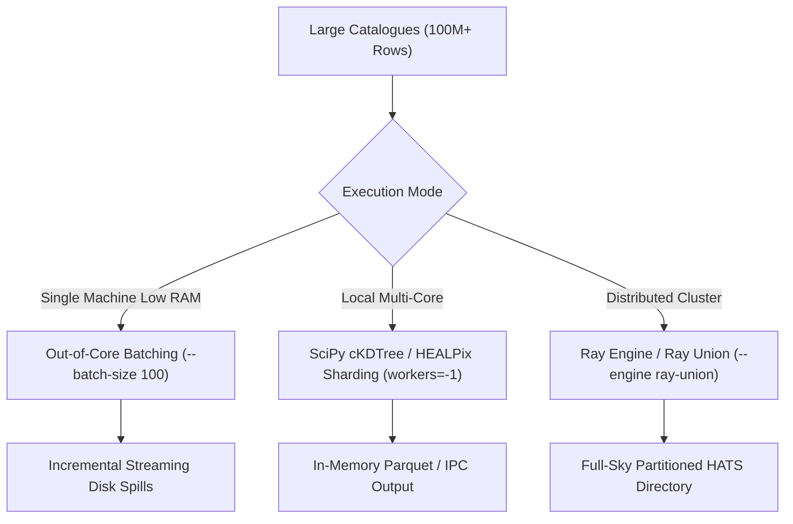

# xmatch User Guide & Cookbooks

A practical, end-to-end user manual for astronomical catalogue crossmatching using `xmatch`.

---

## 1. Installation & Environment Setup

`xmatch` requires Python $\ge 3.13$ (Python 3.13 and 3.14 supported). It is built natively on the **Polars** streaming dataframe engine, with optional hardware, distributed, and remote archive accelerators.

### Recommended: Pixi Workflow

For reproducibility and automatic resolution of compiled C/Rust/Fortran dependencies (such as `cdshealpix`, `ray`, `numpy`):

```bash
# Clone the repository
git clone https://github.com/astroai/xmatch.git
cd xmatch

# Install all environments and dependencies
pixi install

# Run preflight verification
pixi run preflight-push
```

### Standard: Pip Installation

```bash
# Minimal core installation
pip install xmatch

# Full scientific stack with all optional extras
pip install "xmatch[cds,hats,ray,torchsky,torchfits,ml]"
```

#### Optional Dependency Extras

| Extra | Packages | Purpose |
|---|---|---|
| `[cds]` | `astroquery` | CDS VizieR and CDS XMatch remote service backends. |
| `[zone]` | `cdshealpix` | HEALPix spatial zoning engine. |
| `[hats]` | `hats`, `cdshealpix` | Hierarchical Adaptive Tiling Scheme (HATS) native reading and spatial partitioning. |
| `[hats-ray]` | `hats`, `ray`, `cdshealpix` | Native HATS + Ray pixel matcher and `ray-union` full-sky union engine (no Dask). |
| `[ray]` | `ray`, `cdshealpix` | Distributed parallel HEALPix pixel-batch matching across clusters and multi-core nodes. |
| `[torchfits]` | `torchfits` | High-speed, Arrow/Polars-native local FITS table reader. |
| `[torchsky]` | `torchsky` | Tensor-native nearest-neighbour spatial engine with coarse HEALPix pruning. |
| `[ml]` | `scikit-learn`, `xgboost`, `lightgbm`, `joblib` | Machine-learning (`matcher="ml"`) and gradient-boosted (`matcher="xgb"`) probabilistic matchers. |

---

## 2. 2-Minute Quickstart

### Command Line Interface (CLI)

```bash
# 1. Match two local files with a 1.5 arcsecond radius
xmatch match catalog1.parquet catalog2.csv -o matches.parquet -r 1.5

# 2. Match a local file against remote Gaia DR3 (auto-downloads cone from TAP)
xmatch match my_targets.csv gaia -o my_gaia.parquet -r 1.0

# 3. Full-outer join (union) of three catalogues into a partitioned HATS directory
xmatch match survey1.parquet survey2.csv survey3.fits --union -o /data/master.hats
```

### Python API

```python
from xmatch import CrossMatch

cm = CrossMatch()

# High-performance pairwise match
df = cm.crossmatch(
    "optical.parquet",
    "infrared.csv",
    radius_arcsec=1.5,
    engine="fast",  # SciPy cKDTree on 3D unit sphere
    join_type="1and2",  # Inner join
)

print(f"Matched {len(df)} pairs. Output columns include: {df.columns[:5]}")
```

---

## 3. Universal Formats & Storage

`xmatch` abstracts away data storage and format idiosyncrasies. All inputs are ingested into **Polars LazyFrames**, enabling streaming execution with zero unnecessary data materialization.



### Supported Formats Overview

| Format | Extension | Read Engine | Write Engine | Memory Footprint |
|---|---|---|---|---|
| **Parquet** | `.parquet` | `pl.scan_parquet` | `sink_parquet(streaming=True)` | Bounded / Streaming |
| **CSV** | `.csv` | `pl.scan_csv` | `sink_csv(streaming=True)` | Bounded / Streaming |
| **TSV / Tab** | `.tsv`, `.tab` | `pl.scan_csv(separator="\t")` | `sink_csv(separator="\t")` | Bounded / Streaming |
| **FITS** | `.fits`, `.fit` | `torchfits` (fallback Astropy) | `polars_to_astropy().write()` | Eager |
| **HATS** | directory | Native HATS pixel reader | `write_hats()` / `ray_union` | Partitioned / Out-of-core |
| **VOSpace** | `vos:*` | `storage.py` staging | Staged upload to VOSpace node | Bounded |

### Streaming vs. Eager Execution

```python
# Streaming Execution: Does not load data into RAM; streams to output parquet sink
cm.crossmatch(
    "huge_catalog_100M.parquet",
    "reference_survey.parquet",
    output_file="out_streamed.parquet",
    lazy=False,
)

# Return as LazyFrame for further Polars query transformations
lazy_result = cm.crossmatch(
    "catalog_a.parquet",
    "catalog_b.csv",
    lazy=True,
)

# Chain Polars expressions before collecting
filtered = (
    lazy_result.filter(pl.col("sep_arcsec") < 0.5)
    .select(["ra", "dec", "phot_g_mean_mag"])
    .collect()
)
```

---

## 4. Remote Archive Federation & Discovery

`xmatch` comes pre-configured with major astronomical TAP services (ESA Gaia, CDS VizieR, and NOIRLab Data Lab).

### Querying Remote Archives Automatically

When a remote catalogue name is supplied as an input, `xmatch` calculates the bounding spatial cone of the local catalogue, queries the remote archive via TAP/ADQL, downloads the candidate region, and performs local spatial matching:

```bash
# Query Gaia DR3 within the footprint of my_sources.csv
xmatch match my_sources.csv gaia -r 1.0 -o matches.parquet

# Query with explicit celestial coordinates (e.g. 0.05 degree cone around Vega)
xmatch match gaia my_catalog.csv --ra 279.23 --dec 38.78 --radius-deg 0.05 -r 1.5
```

### Pre-Computed Crossmatch Tables (Fast-Path)

NOIRLab Data Lab provides pre-computed crossmatch tables (e.g., NSC $\times$ Gaia, DES $\times$ Gaia, AllWISE $\times$ Gaia). `xmatch` can match directly against these pre-computed tables, downloading only the matched pairs:

```bash
# Instant NSC × Gaia match without downloading full survey catalogues
xmatch match nsc_x_gaia my_stars.csv --ra 279.2 --dec 38.8 --radius-deg 0.01 -r 1.5
```

### Interactive Remote Archive Discovery

```bash
# List all built-in catalogue aliases
xmatch list

# Search remote TAP endpoints for datasets matching a keyword
xmatch search rubin
xmatch search unWISE

# Inspect tables on a specific remote archive (e.g. NOIRLab Data Lab)
xmatch discover noirlab

# Inspect column schema and generate YAML configuration snippet
xmatch discover noirlab --schema nsc_dr2.object

# Adopt a discovered table into your local xmatch configuration
xmatch adopt vizier II/349/ps1 --name ps1
```

---

## 5. Local Mirroring & Offline Caching (`xmatch sync`)

For repeated analysis or full-sky union operations, `xmatch` can mirror remote catalogues into a local, durable HATS cache (`~/.cache/xmatch` or CANFAR `/arc/projects/hats`).

```bash
# Mirror full remote surveys into local HATS cache
xmatch sync gaia allwise twomass

# Re-syncing is incremental: unchanged partitions are skipped automatically
xmatch sync gaia

# Force full re-download
xmatch sync gaia --force
```

### Benefits of Local Mirroring:
1. **Network Immunity**: Queries execute locally without hitting external archive rate limits or downtime.
2. **High-Speed I/O**: Mirrored data is partitioned into spatial HATS parquet files, allowing fast spatial queries.
3. **Cluster Scalability**: Enables distributed `engine="ray-union"` workflows where worker nodes read directly from shared local cache storage.

---

## 6. SOTA Crossmatch Algorithms Cookbook

### A. Simple Positional Matching (`matcher="sky"`)

Standard great-circle angular distance criterion: $\text{sep} \le \text{radius\_arcsec}$.

```python
spec = MatchSpec(radius_arcsec=1.2, matcher="sky", find="best")
result = cm.crossmatch("cat_a.parquet", "cat_b.parquet", spec=spec)
```

### B. Adaptive Astrometric Uncertainties (`matcher="skyerr"`)

Adapts the match radius per row based on positional error columns:

$$\text{sep} \le N_{\sigma} \cdot (\sigma_1 + \sigma_2)$$

```python
# Requires ra_error and dec_error columns in each catalogue
spec = MatchSpec(matcher="skyerr", max_error=3.0, find="best")
result = cm.crossmatch("gaia_dr3.parquet", "hst_sources.csv", spec=spec)
```

### C. 2D Gaussian Error Ellipses (`matcher="skyellipse"`)

Evaluates full 2D positional covariance matrices ($C = C_1 + C_2$) via the Mahalanobis distance:

$$d^2 = \Delta \mathbf{r}^T C^{-1} \Delta \mathbf{r} \le N_{\sigma}^2$$

```python
spec = MatchSpec(matcher="skyellipse", max_error=3.0, find="best")
result = cm.crossmatch("chandra_xray.fits", "vla_radio.parquet", spec=spec)
```

### D. Proper Motions & Target Epoch Propagation (`target_epoch`)

Propagates coordinates across epoch baselines to a common Julian-year target epoch:

```python
spec = MatchSpec(
    radius_arcsec=1.0,
    target_epoch=2016.0,  # Gaia DR3 reference epoch
)
result = cm.crossmatch("historical_survey_1995.csv", "gaia_dr3.parquet", spec=spec)
```

### E. Probabilistic Proper-Motion Drift Prior (Wilson 2023)

When matching catalogues separated by years or decades where one side lacks proper motion measurements, stars drift due to Galactic kinematics. The Wilson (2023) model inflates the positional error budget based on Galactic latitude:

$$\sigma_\mu(b) = 3 + 7 \exp\left(-\frac{|b|}{20^\circ}\right) \quad [\text{mas/yr}], \quad \sigma_{\text{drift}} = \sigma_\mu \cdot \frac{|\Delta t|}{1000} \quad [\text{arcsec}]$$

```python
spec = MatchSpec(
    radius_arcsec=3.0,
    matcher="skyerr",
    target_epoch=2016.0,
    pm_prior=True,
    pm_prior_magnitude_column="phot_g_mean_mag",  # Optional magnitude proxy
)
result = cm.crossmatch("usno_b1.parquet", "gaia_dr3.parquet", spec=spec)
```

### F. Likelihood Ratio Counterpart Identification (`matcher="lr"`)

Sutherland & Saunders (1992) method for cross-identifying surveys with disparate resolutions (e.g. radio to optical):

$$LR = \frac{q(m) \cdot f(r)}{n(m)}, \quad R_j = \frac{LR_j}{\sum_i LR_i + (1 - Q)}$$

```python
spec = MatchSpec(
    radius_arcsec=2.5,
    matcher="lr",
    lr_magnitude_column="r_mag",
    lr_q=0.8,
)
result = cm.crossmatch("radio_catalog.csv", "optical_catalog.parquet", spec=spec)
# Result includes 'lr' and 'reliability' columns in [0, 1]
```

### G. Machine Learning Classifiers (`matcher="ml"`, `matcher="xgb"`)

Trained on-the-fly with nearest-neighbour pseudo-labels using normalized separations, multi-band color differences, and local source densities:

```python
spec = MatchSpec(
    radius_arcsec=2.0,
    matcher="xgb",
    ml_color_columns=["g", "r", "i"],
    xgb_model_path="trained_crossmatch_model.joblib",  # Save/load model artifact
)
result = cm.crossmatch("survey_a.parquet", "survey_b.parquet", spec=spec)
# Result includes 'xgb_score' column in [0, 1]
```

### H. Empirical Astrometric Uncertainty Function (`matcher="auf"`, `matcher="macauff"`)

Wilson & Naylor (2017) non-Gaussian error model capturing real-world ground-based PSF wings:

```python
spec = MatchSpec(
    radius_arcsec=2.0,
    matcher="macauff",
    macauff_flux_columns=["g_mag", "r_mag"],
)
result = cm.crossmatch("ground_based.parquet", "space_telescope.parquet", spec=spec)
# Result includes 'macauff_prob' column
```

---

## 7. Relational Joins & Multi-Catalogue Chains

### Join Modes

| `join_type` | Conventional Name | Rows Emitted |
|---|---|---|
| `"1and2"` | Inner Join | Only matched pairs. |
| `"all1"` | Left Outer Join | All left rows; right rows matched or filled with `null`. |
| `"all2"` | Right Outer Join | All right rows; left rows matched or filled with `null`. |
| `"1or2"` / `"all"` | Full Outer Join (Union) | Every source from both catalogues (unmatched slots `null`). |
| `"1not2"` | Left Anti-Join | Left sources with **no** counterpart in the right catalogue. |
| `"2not1"` | Right Anti-Join | Right sources with **no** counterpart in the left catalogue. |

```python
# Anti-join: Find transient candidates with NO archival Gaia counterpart
transients = cm.crossmatch(
    "new_detections.parquet",
    "gaia",
    radius_arcsec=2.0,
    join_type="1not2",
)
```

### Relational ID Join (`id_join=True`)

Performs a pure relational join on identifier columns (e.g. `source_id`, `objid`) without coordinate calculations:

```python
result = cm.crossmatch(
    "photometry.parquet",
    "redshifts.csv",
    id_join=True,
    id_column_1="target_id",
    id_column_2="target_id",
)
```

### Multi-Catalogue Sequential Chains (`crossmatch_multi`)

```python
# 4-survey crossmatch chain: Gaia × AllWISE × 2MASS × Pan-STARRS
multi_match = cm.crossmatch_multi(
    ["gaia_dr3.parquet", "allwise.parquet", "twomass.parquet", "panstarrs.parquet"],
    radius_arcsec=1.5,
    join_type="1and2",
)
```

---

## 8. Scaling to Billions of Rows



### Single-Node Out-of-Core Processing

When memory is constrained, set `engine="zone"` and `batch_size`:

```bash
xmatch match large_survey_a.parquet large_survey_b.parquet \
  --engine zone \
  --batch-size 250 \
  -o out.parquet
```

### Ray Distributed Cluster Crossmatching

`engine="ray"` distributes HEALPix spatial candidate search across Ray workers and supports **all** crossmatch algorithms (`sky`, `skyerr`, `skyellipse`, `lr`, `ml`, `xgb`, `auf`, `macauff`), multimodal $N$-dimensional ranking (`extra_distance_cols`), Bayesian qualification (`probabilistic=True`, `nway_match`), transitive closure (`fof_match`), and proper-motion propagation (`target_epoch`, `pm_prior`) across flat files, in-memory frames, and HATS directories:

```bash
# Connect to an existing cluster or start local Ray workers
xmatch match full_sky_a.parquet full_sky_b.parquet \
  --engine ray \
  --matcher lr \
  --lr-mag-col r_mag \
  -r 2.0 \
  -o ray_output.parquet
```

```python
from xmatch import CrossMatch, MatchRequest, MatchSpec

cm = CrossMatch()

# Distributed Ray crossmatch with XGBoost, epoch alignment, and Bayesian posterior
req = MatchRequest(
    cat1="survey_a.hats",
    cat2="survey_b.hats",
    engine="ray",
    probabilistic=True,
    spec=MatchSpec(
        radius_arcsec=2.0,
        matcher="xgb",
        ml_color_columns=["g_mag", "r_mag"],
        prior_columns=["g_mag"],
        target_epoch=2016.0,
    ),
)
matches = cm.crossmatch_request(req)

# Distributed Bayesian N-way and Friends-of-Friends clustering on Ray
nway_df = cm.nway_match(
    ["gaia_sample.parquet", "wise_sample.parquet", "twomass_sample.parquet"],
    radius_arcsec=1.5,
    prior_columns=["phot_g_mean_mag"],
    engine="ray",
)
fof_df = cm.fof_match(
    ["gaia_sample.parquet", "wise_sample.parquet", "twomass_sample.parquet"],
    radius_arcsec=1.5,
    engine="ray",
)
```

---

## 9. Building Persistent HATS Master Unions for Sky Foundation Models

The primary architectural goal of `xmatch` is accumulating multi-survey photometry into a persistent, evolving full-sky HATS dataset.

### Step 1: Mirror Core Baseline Surveys

```bash
xmatch sync gaia allwise twomass des ls_dr10
```

### Step 2: Generate Full-Sky Master Union

Run `engine="ray-union"` to produce a unified, partitioned HATS master catalog (supporting `matcher="sky"`, `"skyerr"`, or `"skyellipse"`, `target_epoch`, and `pm_prior`):

```bash
xmatch match gaia allwise twomass des ls_dr10 \
  --union \
  --engine ray-union \
  --matcher skyerr \
  --max-error 3.0 \
  --target-epoch 2016.0 \
  -o /arc/projects/hats/master_union_v1.hats
```

### Step 3: Inspect Output HATS Structure

The generated catalogue conforms to standard HATS partitioning:
```text
master_union_v1.hats/
├── properties
├── dataset/
│   ├── partition_info.parquet
│   ├── _metadata
│   └── Norder=1/
│       └── Dir=0/
│           ├── Npix=12.parquet
│           └── Npix=13.parquet
```

### Step 4: Stream Training Batches Directly to Foundation Models

Using Polars streaming parquet reader or PyTorch dataloaders:

```python
import polars as pl

# Scan full-sky master union lazily without loading the dataset into memory
master = pl.scan_parquet("/arc/projects/hats/master_union_v1.hats/dataset/*/*/*.parquet")

# Extract aligned multi-band photometry for model training
features = (
    master.filter(pl.col("phot_g_mean_mag").is_not_null() & pl.col("w1mpro").is_not_null())
    .select(["ra", "dec", "phot_g_mean_mag", "phot_bp_mean_mag", "w1mpro", "w2mpro", "j_m", "h_m"])
    .collect(engine="streaming")
)
```

---

## 10. 🔭 Astronomer's Field Guide: Realistic Science Use Cases & Cookbooks

Putting on the hat of an observational and computational astronomer, here are field-tested recipes for common challenges:

### Use Case 1: Radio/X-Ray to Optical/NIR Multi-Wavelength Counterpart Identification
**The Challenge**: Identifying host galaxies for 10,000 ASKAP EMU radio sources with elongated synthesized beams (2.5″ $\times$ 1.2″ ellipses) inside deep DES optical fields. In dense environments, simple cone searches yield 3–5 optical candidates per radio beam, with high chance alignment rates.

```python
from xmatch import CrossMatch, MatchRequest, MatchSpec, SideOverrides

cm = CrossMatch()

# 1. Evaluate 2D Mahalanobis covariance error ellipses + Likelihood Ratio
spec = MatchSpec(
    radius_arcsec=4.0,  # Conservative search bound
    matcher="macauff",  # AUF empirical wings + flux likelihood ratio
    macauff_flux_columns=["mag_r", "mag_i", "w1_mag"],
    find="best",
)

req = MatchRequest(
    cat1="askap_radio_sources.fits",
    cat2="des_dr2_optical.parquet",
    spec=spec,
    side1=SideOverrides(
        ra_column="ra_radio",
        dec_column="dec_radio",
    ),
    side2=SideOverrides(
        ra_column="ra_des",
        dec_column="dec_des",
    ),
)

matches = cm.crossmatch_request(req)

# Filter for statistically reliable counterparts (R > 0.8)
reliable_hosts = matches.filter(pl.col("macauff_prob") > 0.8)
print(f"Identified {len(reliable_hosts)} robust radio host galaxies.")
```

### Use Case 2: High Proper-Motion & Brown Dwarf Search Across a 70-Year Epoch Baseline
**The Challenge**: Crossmatching USNO-B1.0 (photographic plates, mean epoch $\approx 1950.0$) against Gaia DR3 (epoch 2016.0) to find nearby ultracool dwarfs. A star with $\mu = 400\,\text{mas/yr}$ moved $26.4''$ over the baseline, and USNO lacks reliable proper motions.

```python
# Use the Wilson (2023) PM drift prior to adaptively inflate the search radius along Galactic latitude
spec = MatchSpec(
    radius_arcsec=5.0,
    matcher="skyerr",
    max_error=4.0,
    target_epoch=2016.0,  # Propagate Gaia to common 2016 epoch
    pm_prior=True,  # Activate Wilson (2023) PM drift prior
    pm_prior_magnitude_column="phot_g_mean_mag",  # Distance proxy: brighter = faster PM
    find="best",
)

# old_catalog.csv has coordinates and epoch=1950.0; gaia has measured pmra/pmdec
matches = cm.crossmatch("usno_b1_sample.csv", "gaia_dr3.parquet", spec=spec)
```

### Use Case 3: Time-Domain Transient Alert Filtering (Rubin LSST / ZTF Broker)
**The Challenge**: A new transient candidate alert is reported with $(\alpha, \delta)$ and 0.1″ positional uncertainty. Within milliseconds, determine if it is a known stationary star, a flare in a host galaxy, or an uncatalogued orphan supernova.

```python
# Step 1: Left Anti-Join against archival Gaia DR3 point sources
# If 1not2 returns the alert, NO stationary stellar counterpart exists within 0.8 arcsec.
orphan_alert = cm.crossmatch(
    "new_lsst_alert.parquet",
    "gaia_dr3.parquet",
    radius_arcsec=0.8,
    join_type="1not2",
)

if len(orphan_alert) > 0:
    # Step 2: Search for extended host galaxy in deep Legacy Surveys
    host_match = cm.crossmatch(
        orphan_alert,
        "des_dr2_galaxies.parquet",
        radius_arcsec=10.0,
        find="best",
    )
    print("Alert is a high-priority extragalactic transient candidate!")
```

### Use Case 4: Full-Sky Multi-Band Foundation Dataset Construction
**The Challenge**: Building an aligned, non-redundant training set of 200M sources from Gaia DR3, 2MASS, and AllWISE for a multimodal sky foundation model.

```bash
# 1. Sync full surveys locally into persistent HATS cache
xmatch sync gaia allwise twomass

# 2. Run distributed Ray union to generate full-sky master HATS catalogue
xmatch match gaia allwise twomass \
  --union \
  --engine ray-union \
  -o /arc/projects/hats/fullsky_master_foundation_v1.hats

# 3. Output is fully partitioned and ready for streaming model training
```

