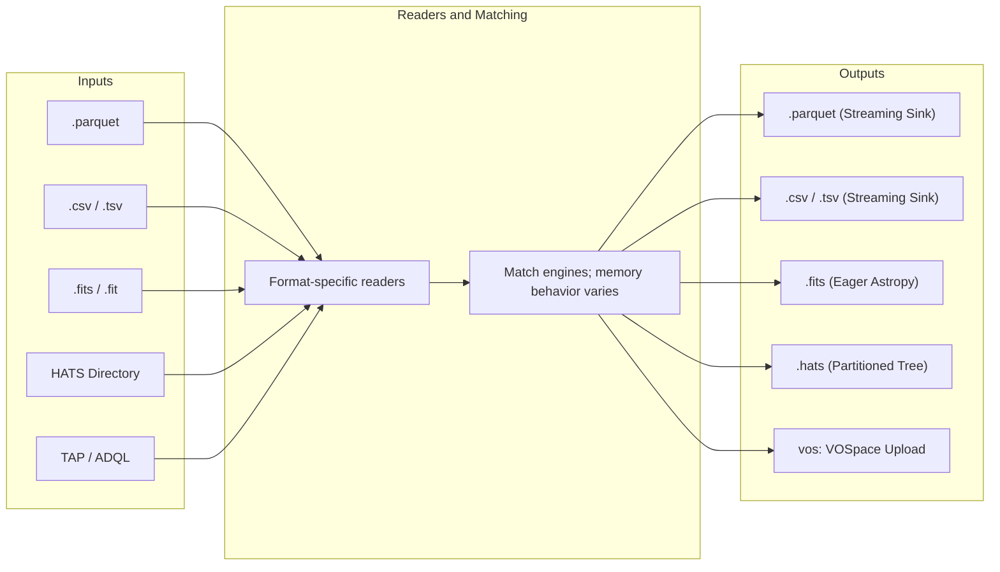

# xmatch User Guide & Cookbooks

A practical, end-to-end user manual for astronomical catalogue crossmatching using `xmatch`.

---

## 1. Installation & Environment Setup

`xmatch` requires Python $\ge 3.13$. The checked Pixi environment uses Python 3.13; optional integrations are installed separately for pip users.

### Recommended: Pixi Workflow

For reproducibility and automatic resolution of compiled C/Rust/Fortran dependencies (such as `cdshealpix`, `ray`, `numpy`):

```bash
# Clone the repository
git clone https://github.com/astroai/xmatch.git
cd xmatch

# Install all environments and dependencies
pixi install

# Run lint, formatting, bytecode, and offline tests
pixi run ci-local
```

### Pip from a checkout

```bash
git clone https://github.com/astroai/xmatch.git
cd xmatch

# Install the core and optional integrations used by this checkout
python -m pip install ".[cds,hats-ray,torchfits,ml]"
```

The PyPI name `xmatch` belongs to another project. The source repository and
[v0.5.0 GitHub release](https://github.com/astroai/xmatch/releases/tag/v0.5.0)
are public. Do not use `pip install xmatch` for this project.

#### Optional Dependency Extras

| Extra | Packages | Purpose |
|---|---|---|
| `[cds]` | `astroquery` | CDS VizieR and CDS XMatch remote service backends. |
| `[zone]` | `cdshealpix` | HEALPix spatial zoning engine. |
| `[hats]` | `hats`, `cdshealpix` | Hierarchical Adaptive Tiling Scheme (HATS) native reading and spatial partitioning. |
| `[hats-ray]` | `hats`, `ray`, `cdshealpix` | Native HATS + Ray pixel matcher and `ray-union` full-sky union engine (no Dask). |
| `[ray]` | `ray`, `cdshealpix` | Distributed parallel HEALPix pixel-batch matching across clusters and multi-core nodes. |
| `[torchfits]` | `torchfits` | High-speed, Arrow/Polars-native local FITS table reader. |
| `[ml]` | `scikit-learn`, `xgboost`, `lightgbm`, `joblib` | Machine-learning (`matcher="ml"`) and gradient-boosted (`matcher="xgb"`) probabilistic matchers. |

The tensor-native `torchsky` engine is not a pip extra because no `torchsky`
distribution is published on PyPI. It requires a separately installed,
compatible Torchsky checkout; the integration was tested with the sibling
Torchsky 0.4 development source installed editable and Torchfits 1.0.0 from
PyPI.

---

## 2. 2-Minute Quickstart

### Command Line Interface (CLI)

```bash
# 1. Match two local files with a 1.5 arcsecond radius
xmatch match catalog1.parquet catalog2.csv -o matches.parquet -r 1.5

# 2. Match a local file against remote Gaia DR3 (auto-downloads cone from TAP)
xmatch match my_targets.csv gaia -o my_gaia.parquet -r 1.0

# 3. Full-outer join (union) of three catalogues into a partitioned HATS directory
xmatch match survey1.parquet survey2.csv survey3.fits --union -o /data/master.hats
```

### Python API

```python
from xmatch import CrossMatch

cm = CrossMatch()

# High-performance pairwise match
df = cm.crossmatch(
    "optical.parquet",
    "infrared.csv",
    radius_arcsec=1.5,
    engine="fast",  # SciPy cKDTree on 3D unit sphere
    join_type="1and2",  # Inner join
)

print(f"Matched {len(df)} pairs. Output columns include: {df.columns[:5]}")
```

---

## 3. Formats & Storage

`xmatch` reads supported formats through Polars and Astropy-backed adapters. File scanning and output serialization can be lazy or streaming, but most match engines collect coordinates and candidate pairs in memory.



### Supported Formats Overview

| Format | Extension | Read Engine | Write Engine | Memory Footprint |
|---|---|---|---|---|
| **Parquet** | `.parquet` | `pl.scan_parquet` | Polars streaming sink | Input scan/output can stream; matching may materialize |
| **CSV** | `.csv` | `pl.scan_csv` | Polars streaming sink | Input scan/output can stream; matching may materialize |
| **TSV / Tab** | `.tsv`, `.tab` | `pl.scan_csv(separator="\t")` | Polars streaming sink | Input scan/output can stream; matching may materialize |
| **FITS** | `.fits`, `.fit` | `torchfits` (fallback Astropy) | `polars_to_astropy().write()` | Eager |
| **HATS** | directory | Native HATS pixel reader | `write_hats()` / `ray_union` | Partitioned input; matching memory depends on engine and path |
| **VOSpace** | `vos:*` | `storage.py` staging | Staged upload to VOSpace node | Bounded |

### Lazy output and bounded-memory matching

```python
# Output serialization can stream; this alone does not bound matching memory.
cm.crossmatch(
    "huge_catalog_100M.parquet",
    "reference_survey.parquet",
    output_file="out_streamed.parquet",
    lazy=False,
)

# Return as LazyFrame for further Polars query transformations
lazy_result = cm.crossmatch(
    "catalog_a.parquet",
    "catalog_b.csv",
    lazy=True,
)

# Chain Polars expressions before collecting
filtered = (
    lazy_result.filter(pl.col("sep_arcsec") < 0.5)
    .select(["ra", "dec", "phot_g_mean_mag"])
    .collect()
)
```

For pairwise local CSV/Parquet matching, `--memory-budget-bytes` enables a
partitioned spill path when projected inputs exceed the budget:

```bash
xmatch match large_a.parquet large_b.parquet \
  --memory-budget-bytes 1073741824 --scratch-dir /scratch/xmatch \
  --matcher sky --join-type 1or2 -o matches.parquet
```

This path currently supports pairwise `sky` and `skyerr`, inner or full-outer
joins, and CSV/Parquet inputs and outputs. It rejects ID joins, `skyellipse`,
N-way operations, priors, extra-distance features, post-filters, and the missing
motion prior. Its budget bounds an internal batch-memory proxy, not all process
memory; temporary disk space is required. Convert large FITS inputs to Parquet
first. `--batch-size` controls HEALPix pixel groups in the zone path; it is not
a general memory limit.

---

## 4. Remote Archive Federation & Discovery

`xmatch` includes catalogue and endpoint configurations for several TAP services. Availability, access policy, table schemas, and service limits can change; verify them with `xmatch search` / `xmatch describe` before large queries.

### Querying Remote Archives Automatically

When a remote catalogue name is supplied as an input, `xmatch` calculates the bounding spatial cone of the local catalogue, queries the remote archive via TAP/ADQL, downloads the candidate region, and performs local spatial matching:

```bash
# Query Gaia DR3 within the footprint of my_sources.csv
xmatch match my_sources.csv gaia -r 1.0 -o matches.parquet

# Query with explicit celestial coordinates (e.g. 0.05 degree cone around Vega)
xmatch match gaia my_catalog.csv --ra 279.23 --dec 38.78 --radius-deg 0.05 -r 1.5
```

The optimized server-side CDS/TAP crossmatch route is limited to simple
`sky`/`find="all"` inner matches with automatic engine selection and no
explicit region, post-filter, N-D feature, projection, or photometric prior.
Other requests use a regional download followed by local matching. Two remote
TAP catalogues cannot infer a query region from local coordinates; provide an
explicit `ra`, `dec`, and `radius_deg` cone (especially for `find="best"`).
Remote `skyerr`, `skyellipse`, and `target_epoch` requests also require that
explicit cone, even when the other input is local: the remote service's
uncertainty or motion halo is not known well enough to derive a safe region.
Choose a cone that covers the requested match area and its uncertainty or
motion margin.

### Pre-Computed Crossmatch Tables (Fast-Path)

NOIRLab Data Lab provides pre-computed crossmatch tables (e.g., NSC $\times$ Gaia, DES $\times$ Gaia, AllWISE $\times$ Gaia). `xmatch` can match directly against these pre-computed tables, downloading only the matched pairs:

```bash
# Instant NSC × Gaia match without downloading full survey catalogues
xmatch match nsc_x_gaia my_stars.csv --ra 279.2 --dec 38.8 --radius-deg 0.01 -r 1.5
```

### Interactive Remote Archive Discovery

```bash
# List all built-in catalogue aliases
xmatch list

# Search remote TAP endpoints for datasets matching a keyword
xmatch search rubin
xmatch search unWISE

# Inspect tables on a specific remote archive (e.g. NOIRLab Data Lab)
xmatch discover noirlab

# Inspect column schema and generate YAML configuration snippet
xmatch discover noirlab --schema nsc_dr2.object

# Adopt a discovered table into your local xmatch configuration
xmatch adopt vizier II/349/ps1 --name ps1
```

---

## 5. Local Mirroring & Offline Caching (`xmatch sync`)

For repeated analysis or full-sky union operations, `xmatch` can mirror remote catalogues into a local, durable HATS cache (`~/.cache/xmatch` or CANFAR `/arc/projects/hats`).

```bash
# Mirror full remote surveys into local HATS cache
xmatch sync gaia allwise twomass

# Re-sync checks TAP page windows or hashes remote HATS partition content.
xmatch sync gaia

# Force full re-download
xmatch sync gaia --force
```

### Benefits of Local Mirroring:
1. **Network Immunity**: Queries execute locally without hitting external archive rate limits or downtime.
2. **High-Speed I/O**: Mirrored data is partitioned into spatial HATS parquet files, allowing fast spatial queries.
3. **Distributed union**: Mirrored HATS inputs can feed `engine="ray-union"`; the cache path must be visible to the Ray workers.

TAP resume requires a stable, unique, non-null key. The page-window row-count
check does not detect edits that preserve the page's count; use `--force` after
such mutations or when expanding the page window. Append-only growth is checked
with a maximum-key probe. Remote HATS synchronization compares partition
content hashes on each sync attempt; this detects same-size edits but can
require reading substantial remote data.

---

## 6. Crossmatch algorithm cookbook

```python
from xmatch import CrossMatch, MatchRequest, MatchSpec, SideOverrides

cm = CrossMatch()
```

### A. Simple Positional Matching (`matcher="sky"`)

Standard great-circle angular distance criterion: $\text{sep} \le \text{radius\_arcsec}$.

```python
spec = MatchSpec(radius_arcsec=1.2, matcher="sky", find="best")
result = cm.crossmatch_request(MatchRequest(cat1="cat_a.parquet", cat2="cat_b.parquet", spec=spec))
```

### B. Adaptive Astrometric Uncertainties (`matcher="skyerr"`)

Adapts the match radius per row based on positional error columns:

$$\text{sep} \le N_{\sigma} \cdot (\sigma_1 + \sigma_2)$$

```python
# Supply per-side columns/units, or configure equivalent metadata in xmatch.yaml.
spec = MatchSpec(matcher="skyerr", max_error=3.0, find="best")
req = MatchRequest(
    cat1="gaia_dr3.parquet",
    cat2="hst_sources.csv",
    spec=spec,
    side1=SideOverrides(ra_err_column="ra_error", dec_err_column="dec_error", pos_err_units="mas"),
    side2=SideOverrides(
        ra_err_column="ra_error", dec_err_column="dec_error", pos_err_units="arcsec"
    ),
)
result = cm.crossmatch_request(req)
```

### C. 2D Gaussian Error Ellipses (`matcher="skyellipse"`)

Evaluates full 2D positional covariance matrices ($C = C_1 + C_2$) via the Mahalanobis distance:

$$d^2 = \Delta \mathbf{r}^T C^{-1} \Delta \mathbf{r} \le N_{\sigma}^2$$

```python
spec = MatchSpec(matcher="skyellipse", max_error=3.0, find="best")
req = MatchRequest(
    cat1="chandra_xray.fits",
    cat2="vla_radio.parquet",
    spec=spec,
    side1=SideOverrides(
        ra_err_column="ra_err",
        dec_err_column="dec_err",
        corr_column="ra_dec_corr",
        pos_err_units="arcsec",
    ),
    side2=SideOverrides(
        ra_err_column="ra_err",
        dec_err_column="dec_err",
        corr_column="ra_dec_corr",
        pos_err_units="arcsec",
    ),
)
result = cm.crossmatch_request(req)
```

### D. Proper Motions & Target Epoch Propagation (`target_epoch`)

Propagates coordinates across epoch baselines to a common Julian-year target epoch:

```python
spec = MatchSpec(
    radius_arcsec=1.0,
    target_epoch=2016.0,  # Julian-year epoch for both catalogues
)
req = MatchRequest(
    cat1="historical_survey_1995.csv",
    cat2="gaia_dr3.parquet",
    spec=spec,
    side1=SideOverrides(epoch=1995.0, pm_ra_column="pmra", pm_dec_column="pmdec"),
    side2=SideOverrides(epoch=2016.0, pm_ra_column="pmra", pm_dec_column="pmdec"),
)
result = cm.crossmatch_request(req)
```

Rows away from the requested epoch need a known reference epoch and finite
proper motions (unless the explicit `pm_prior` model is enabled). Coordinates
must have compatible declared frames; `xmatch` does not convert frames.

### E. Assumed Proper-Motion Drift Model (Wilson 2023-inspired)

When some rows lack measured motion and have a known epoch, the explicitly
requested Wilson (2023)-inspired model adds an assumed drift uncertainty based on
Galactic latitude:

$$\sigma_\mu(b) = 3 + 7 \exp\left(-\frac{|b|}{20^\circ}\right) \quad [\text{mas/yr}], \quad \sigma_{\text{drift}} = \sigma_\mu \cdot \frac{|\Delta t|}{1000} \quad [\text{arcsec}]$$

```python
spec = MatchSpec(
    radius_arcsec=3.0,
    matcher="skyerr",
    target_epoch=2016.0,
    pm_prior=True,
    pm_prior_magnitude_column="phot_g_mean_mag",  # Optional magnitude proxy
)
result = cm.crossmatch_request(
    MatchRequest(cat1="usno_b1.parquet", cat2="gaia_dr3.parquet", spec=spec)
)
```

This is a population model, not measured motion or a substitute for a
catalogue-specific uncertainty model. Generic TAP schema discovery does not
invent positional errors; configure errors or supply per-side error columns for
uncertainty-aware matching.

### F. Likelihood Ratio Counterpart Identification (`matcher="lr"`)

Sutherland & Saunders (1992) method for cross-identifying surveys with disparate resolutions (e.g. radio to optical):

$$LR = \frac{q(m) \cdot f(r)}{n(m)}, \quad R_j = \frac{LR_j}{\sum_i LR_i + (1 - Q)}$$

```python
spec = MatchSpec(
    radius_arcsec=2.5,
    matcher="lr",
    lr_magnitude_column="r_mag",
    lr_q=0.8,
)
result = cm.crossmatch_request(
    MatchRequest(cat1="radio_catalog.csv", cat2="optical_catalog.parquet", spec=spec)
)
# Result includes 'lr' and 'reliability' columns in [0, 1]
```

### G. Machine Learning Classifiers (`matcher="ml"`, `matcher="xgb"`)

Trained on-the-fly with nearest-neighbour pseudo-labels using normalized separations, multi-band color differences, and local source densities:

```python
spec = MatchSpec(
    radius_arcsec=2.0,
    matcher="xgb",
    ml_color_columns=["g", "r", "i"],
    xgb_model_path="trained_crossmatch_model.joblib",  # Save/load model artifact
)
result = cm.crossmatch_request(
    MatchRequest(cat1="survey_a.parquet", cat2="survey_b.parquet", spec=spec)
)
# Result includes 'xgb_score' column in [0, 1]
```

### H. AUF-inspired empirical scores (`matcher="auf"`, `matcher="macauff"`)

These lightweight heuristics estimate a positional score by subtracting an
estimated background from the observed candidate-separation distribution.
`macauff` additionally multiplies by approximate per-column magnitude
likelihood ratios. They are not full reproductions of Wilson & Naylor's
published AUF/macauff methods and their scores are not calibrated probabilities.

```python
spec = MatchSpec(
    radius_arcsec=2.0,
    matcher="macauff",
    macauff_flux_columns=["g_mag", "r_mag"],
)
result = cm.crossmatch_request(
    MatchRequest(cat1="ground_based.parquet", cat2="space_telescope.parquet", spec=spec)
)
# Result includes a heuristic 'macauff_prob' score in [0, 1], not a calibrated probability
```

### I. Bayesian pairwise qualification

Set `probabilistic=True` for a positional-only `p_match`, or set nonempty
`prior_columns` to enable the score with empirical photometric KDE terms. Both
inputs must provide declared positional errors or explicit per-side error
floors; every prior column must be present in both catalogues and have the same
physical meaning:

```python
spec = MatchSpec(radius_arcsec=1.5, prior_columns=["g_mag"])
request = MatchRequest(
    cat1="survey_a.parquet",
    cat2="survey_b.parquet",
    probabilistic=True,
    spec=spec,
    side1=SideOverrides(ra_err_column="ra_err", dec_err_column="dec_err", pos_err_units="arcsec"),
    side2=SideOverrides(ra_err_column="ra_err", dec_err_column="dec_err", pos_err_units="arcsec"),
)
scored = cm.crossmatch_request(request)
```

The score uses equal prior odds and an assumed uniform background inside the
search disc; it is not calibrated to population prevalence or local sky density.
See [Bayesian score assumptions](algorithms.md#8-bayesian-pairwise-qualification-and-n-way-scores).

---

## 7. Relational Joins & Multi-Catalogue Chains

### Join Modes

| `join_type` | Conventional Name | Rows Emitted |
|---|---|---|
| `"1and2"` | Inner Join | Only matched pairs. |
| `"all1"` | Left Outer Join | All left rows; right rows matched or filled with `null`. |
| `"all2"` | Right Outer Join | All right rows; left rows matched or filled with `null`. |
| `"1or2"` / `"all"` | Full Outer Join (Union) | Every source from both catalogues (unmatched slots `null`). |
| `"1not2"` | Left Anti-Join | Left sources with **no** counterpart in the right catalogue. |
| `"2not1"` | Right Anti-Join | Right sources with **no** counterpart in the left catalogue. |

```python
# Anti-join: Find transient candidates with NO archival Gaia counterpart
transients = cm.crossmatch(
    "new_detections.parquet",
    "gaia",
    radius_arcsec=2.0,
    join_type="1not2",
)
```

### Relational ID Join (`id_join=True`)

Performs a pure relational join on identifier columns (e.g. `source_id`, `objid`) without coordinate calculations:

```python
result = cm.crossmatch(
    "photometry.parquet",
    "redshifts.csv",
    id_join=True,
    id_column_1="target_id",
    id_column_2="target_id",
)
```

### Multi-Catalogue Sequential Chains (`crossmatch_multi`)

```python
# 4-survey crossmatch chain: Gaia × AllWISE × 2MASS × Pan-STARRS
multi_match = cm.crossmatch_multi(
    ["gaia_dr3.parquet", "allwise.parquet", "twomass.parquet", "panstarrs.parquet"],
    radius_arcsec=1.5,
    join_type="1and2",
)
```

---

## 8. Choosing an execution path

Engine selection changes where candidate queries run; it does not by itself make
all inputs or outputs out-of-core.

### Pairwise spill matching on one machine

For large local CSV or Parquet pairs, `--memory-budget-bytes` enables the
partitioned spill path when projected input size exceeds the requested budget:

```bash
xmatch match large_a.parquet large_b.parquet \
  --memory-budget-bytes 1073741824 --scratch-dir /scratch/xmatch \
  --matcher sky --join-type 1or2 -o matches.parquet
```

The current spill path supports `sky` and `skyerr`, inner (`1and2`) and full
outer (`1or2`/`all`) joins, and local CSV/Parquet files. It rejects ID joins,
`skyellipse`, N-way matching, post-filters, Bayesian priors, extra-distance
columns, and the missing-motion prior. Convert FITS inputs to Parquet first.
The memory budget applies to an internal batch proxy; it does not cap all Python,
Polars, or OS memory. Scratch space is required. `--batch-size` only controls
HEALPix pixel groups for the zone path and is not a general memory limit.

### Ray pairwise matching

`engine="ray"` distributes HEALPix candidate queries. The driver reads both
inputs into frames and assembles the final candidate result, so coordinator
memory still grows with the input and output. Use it when parallel candidate
search is useful and the coordinator can hold those data. This engine does not
turn an arbitrary flat-file match into an out-of-core operation. Optional
matchers and Ray behavior depend on the selected matcher and installed extras;
unsupported combinations should raise an error rather than silently changing
criteria.

```python
from xmatch import CrossMatch, MatchRequest, MatchSpec

request = MatchRequest(
    cat1="survey_a.parquet",
    cat2="survey_b.parquet",
    engine="ray",
    spec=MatchSpec(radius_arcsec=2.0, matcher="sky", find="all"),
)
matches = CrossMatch().crossmatch_request(request)
```

### HATS-native matching

The native HATS matcher can use partition-neighbor scans for fixed-radius
`sky` matching when both inputs have uniform-order NESTED partitions. Mixed
orders, RING ordering, adaptive positional uncertainties, and target-epoch
alignment use a global materialization path that currently has an O(N) memory
requirement. Native HATS matching can still use Ray for pairwise work after
materialization. Do not treat HATS partitioning alone as a promise of bounded
memory.

### Distributed full-sky union (`ray-union`)

`engine="ray-union"` mirrors its inputs to HATS and writes a full-sky full-outer
union to a HATS directory. It supports `sky`, `skyerr`, and `skyellipse`; it
rejects region-limited requests and unsupported filters, ID joins, scoring
options, and extra columns. Compressed interval planning handles mixed HATS
orders and RING ordering, and distributed tasks apply measured per-source
uncertainty or epoch-motion halos. Planning may scan additional partitions and
can add substantial I/O. `target_epoch`
requires valid epoch and motion metadata for rows needing propagation. Missing
motion without declared finite errors requires an explicit `pm_prior` model.

The output uses a coherent NESTED partition tree. Input measurements are
preserved, and `_union_ra` / `_union_dec` provide non-null routing coordinates
from the lowest-indexed catalogue member in each output row; these columns are
additional to input columns and are the output tree's declared spatial columns.

```bash
xmatch sync gaia allwise twomass
xmatch match gaia allwise twomass \
  --union --engine ray-union \
  -o /arc/projects/hats/master_union.hats
```

Resume state is tied to source identity and metadata. Change the inputs or
configuration and start a new output directory rather than expecting an old
partial run to be reused. For a local end-to-end synthetic smoke test, use
`scripts/canfar-smoke.sh`; it verifies every synthetic singleton ID. Passing
catalogue names runs their complete remote sync and union, then checks only
readability and nonempty output; it requires working credentials and network
access and has no synthetic row-count oracle.

## 9. Friends-of-Friends output policy

`fof_match` searches cross-catalogue edges across all input catalogue pairs,
then forms connected components. This lets an A–B and B–C chain place all
three detections in one component even if A and C are farther apart than the
link radius. Output is primary-anchored: only components containing a source
from the first catalogue are emitted, and secondary-only components are
omitted. Isolated first-catalogue rows are retained. Numeric attributes are
aggregated by mean and nonnumeric attributes use the first value; inspect the
source membership (`_src_cats`) before interpreting an aggregate as one
measurement.
